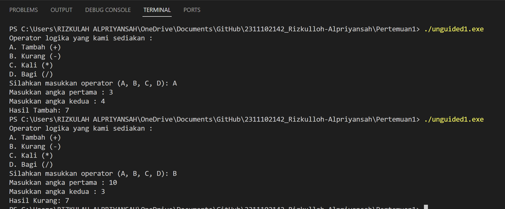
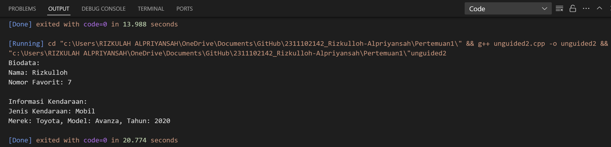
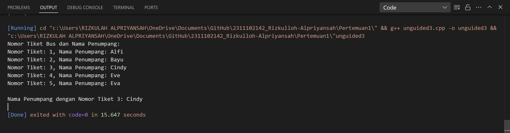

# <h1 align="center">Laporan Praktikum Modul Tipe Data</h1>

<p align="center">Rizkulloh Alpriyansah</p>

## Dasar Teori

1. Tipe Data Primitif:
   Tipe data primitif merupakan tipe data dasar yang tersedia di dalam bahasa pemrograman. Tipe data ini mewakili nilai tunggal dan memiliki ukuran yang tetap.
   Contoh tipe data primitif termasuk integer (bilangan bulat), float (bilangan desimal), double (bilangan desimal dengan presisi ganda), char (karakter), dan bool (nilai kebenaran).
   Tipe data primitif digunakan untuk merepresentasikan data sederhana seperti angka, karakter, atau nilai kebenaran yang tidak memerlukan struktur yang kompleks.

2. Tipe Data Abstrak (ADT - Abstract Data Type):
   Tipe data abstrak merupakan tipe data yang didefinisikan oleh kumpulan operasi yang dapat dilakukan terhadap data tersebut, tanpa mengungkapkan bagaimana operasi tersebut diimplementasikan.
   ADT menyediakan antarmuka yang terstandarisasi untuk berinteraksi dengan data, memungkinkan pengguna untuk menggunakan operasi tersebut tanpa perlu mengetahui detail implementasinya.
   Contoh tipe data abstrak meliputi struktur data seperti stack, queue, linked list, dan tree, serta tipe data kompleks seperti bilangan kompleks atau matriks.

3. Tipe Data Koleksi:
   Tipe data koleksi digunakan untuk menyimpan sejumlah nilai atau objek dalam satu variabel. Ini memungkinkan pengelompokan data menjadi satu unit logis untuk mempermudah pengolahan data.
   Contoh tipe data koleksi termasuk array, vector (di C++), list, set, map, dan hash table.
   Tipe data koleksi memungkinkan pengguna untuk menyimpan dan mengelola data dalam jumlah yang besar dan beragam, serta memberikan akses cepat ke elemen-elemennya.

## Guided

### 1. [tipe data primitif]

```C++
#include <iostream>
#include <iomanip>
using namespace std;
int main() {
char op;
float num1, num2;
// It allows user to enter operator i.e. +, -, *, /
cout << "Enter operator (+, -, *, /): ";
cin >> op;
// It allows user to enter the operands
cout << "Enter two operands: ";
Praktikum Struktur Data dan Algoritma 3
cin >> num1 >> num2;
// Switch statement begins
switch (op) {
// If user enters +
case '+':
cout << "Result: " << num1 + num2;
break;
// If user enters -
case '-':
cout << "Result: " << num1 - num2;
break;
// If user enters *
case '*':
cout << "Result: " << num1 * num2;
break;
// If user enters /
case '/':
if (num2 != 0) {
cout << "Result: " << fixed << setprecision(2) <<
num1 / num2;
} else {
cout << "Error! Division by zero is not allowed.";
}
break;
// If the operator is other than +, -, * or /,
// error message will display
default:
cout << "Error! Operator is not correct";
} // switch statement ends
return 0;
}
```

->Program ini meminta pengguna untuk memasukkan operator (+, -, _, /) dan dua bilangan. Kemudian, program akan melakukan operasi matematika yang sesuai dengan operator tersebut.
Jika operator yang dimasukkan oleh pengguna adalah +, -, _, atau /, maka program akan melakukan operasi tersebut dan menampilkan hasilnya. Jika operator tidak sesuai, program akan memberi tahu pengguna bahwa operator yang dimasukkan tidak benar.
Program juga mengatasi kasus pembagian dengan nol dengan memberi tahu pengguna bahwa pembagian dengan nol tidak diperbolehkan.
Setelah melakukan operasi, program akan berakhir dan keluar dengan nilai 0.

### 2. [Tipe Data Abstrak]

```C++
#include <stdio.h>
#include <string.h>
//tipe data abstrak by Rizkulloh
struct Mahasiswa
{
    char name [50];
    char address [100];
    int age;

};
int main()
{
    struct Mahasiswa mhs1, mhs2;
    strcpy(mhs1.name, "Dian");
    strcpy (mhs1.address, "Mataram");
    mhs1.age = 22;
    strcpy(mhs2.name, "Bambang");
    strcpy(mhs2.address, "Surabaya");
    mhs2.age = 23;

    printf("## Mahasiswa 1 ##\n");
    printf("Nama: %s\n", mhs1.name);
    printf("Alamat: %s\n", mhs1.address);
    printf("Umur: %d\n", mhs1.age);
    printf ("\n");
    printf("## Mahasiswa 2 ##\n");
    printf("Nama: %s\n", mhs2.name);

    printf("Alamat: %s\n", mhs2.address);
    printf("Umur: %d\n", mhs2.age);
    return 0;
}
```

->Program tersebut merupakan contoh penggunaan struktur (struct) dalam bahasa pemrograman untuk merepresentasikan data mahasiswa. Setiap mahasiswa memiliki nama (name), alamat (address), dan umur (age).
Dua variabel bertipe struct Mahasiswa, yaitu mhs1 dan mhs2, digunakan untuk menyimpan informasi dua mahasiswa yang berbeda.
Data untuk setiap mahasiswa diinisialisasi menggunakan fungsi strcpy() untuk menyalin string ke dalam array karakter.
Selanjutnya, program menampilkan informasi masing-masing mahasiswa dengan menggunakan printf().

### 3. [tipe data koleksi]

```C++
#include <iostream>
#include <array>
//tipe data koleksi by Rizkulloh Alpriyansah
using namespace std;
int main() {
// Deklarasi dan inisialisasi array
int nilai[5];
nilai[0] = 23;
nilai[1] = 50;
nilai[2] = 34;
nilai[3] = 78;
nilai[4] = 90;
// Mencetak array dengan tab
cout << "Isi array pertama : " << nilai[0] << endl;
cout << "Isi array kedua : " << nilai[1] << endl;
cout << "Isi array ketiga : " << nilai[2] << endl;
cout << "Isi array keempat : " << nilai[3] << endl;
cout << "Isi array kelima : " << nilai[4] << endl;
return 0;
}
```

->Program di atas merupakan contoh penggunaan array dalam bahasa C++. Array digunakan untuk menyimpan sekumpulan nilai yang memiliki tipe data yang sama.
Dalam program ini, sebuah array bernama "nilai" dengan ukuran 5 elemen dideklarasikan dan diinisialisasi dengan nilai-nilai tertentu.
Kemudian, setiap elemen dari array tersebut dicetak menggunakan perulangan cout. Pesan yang dicetak menampilkan indeks array serta nilainya.
Setelah itu, program berakhir dan mengembalikan nilai 0.

## Unguided

### 1. [ Buatlah program menggunakan tipe data primitif minimal dua fungsi dan bebas.

         Menampilkan program, jelaskan program tersebut dan ambil kesimpulan dari
         materi tipe data primitif!]

```C++
//Di buat oleh Rizkulloh Alpriyansah dengan nim 2311102142
#include <iostream>
#include <cmath>
using namespace std;

int main() {
    char pil_142;
    float ang1_142, ang2_142;

    cout << "Operator logika yang kami sediakan :" << endl;
    cout << "A. Tambah (+)" << endl;
    cout << "B. Kurang (-)" << endl;
    cout << "C. Kali (*)" << endl;
    cout << "D. Bagi (/)" << endl;
    cout << "Silahkan masukkan operator (A, B, C, D): ";
    cin >> pil_142;

    cout << "Masukkan angka pertama : ";
    cin >> ang1_142;
    cout << "Masukkan angka kedua : ";
    cin >>ang2_142;

    switch (pil_142) {
        case 'A':
            cout << "Hasil Tambah: " << ang1_142 + ang2_142 << endl;
            break;
        case 'B':
            cout << "Hasil Kurang: " << ang1_142 - ang2_142 << endl;
            break;
        case 'C':
            cout << "Hasil Kali: " << ang1_142 * ang2_142 << endl;
            break;
        case 'D':
            if (ang2_142 != 0)
                cout << "Hasil Bagi: " << ang1_142 / ang2_142 << endl;
            else
                cout << "Tidak bisa melakukan pembagian dengan nol." << endl;
            break;
        default:
            cout << "Operator tidak valid!" << endl;
            break;
    }

    return 0;
}
```

#### Output:



## ->Penjelasan Program:

Program meminta pengguna untuk memilih operator aritmatika (A, B, C, atau D) dan memasukkan dua angka.
Setelah input diterima, program menggunakan struktur switch-case untuk melakukan operasi sesuai dengan operator yang dimasukkan pengguna.
Jika operator adalah pembagian dan angka kedua adalah nol, program memberikan pesan kesalahan karena tidak dapat melakukan pembagian dengan nol.
Hasil operasi aritmatika kemudian dicetak ke layar.

## ->Kesimpulan

Program ini menggunakan tipe data primitif seperti char untuk menyimpan operator dan float untuk menyimpan angka.
Struktur kontrol switch-case digunakan untuk mengevaluasi operator yang dimasukkan pengguna dan melakukan operasi yang sesuai.
Program ini memberikan kesempatan kepada pengguna untuk melakukan operasi matematika sederhana dengan mudah.
Penggunaan tipe data primitif dalam program ini memungkinkan penulisan kode yang sederhana dan efisien untuk operasi matematika dasar.

### 2. [Jelaskan fungsi dari class dan struct secara detail dan berikan contoh programnya]

```C++
// Dibuat oleh Rizkulloh Dengan NIM 2311102142
#include <iostream>
#include <string>

using namespace std;

// Struct untuk menyimpan nama dan nomor favorit
struct Biodata {
    string nama_142;
    int nomorFavorit_142;
};

// Class untuk merepresentasikan sebuah kendaraan
class Kendaraan {
private:
    string jenis_142;
    string merek_142;
    string model_142;
    int tahun_142;

public:
    // Constructor untuk menginisialisasi objek Kendaraan
    Kendaraan(string jns, string m, string mdl, int thn) : jenis_142(jns), merek_142(m), model_142(mdl), tahun_142(thn) {}

    // Metode untuk menampilkan informasi kendaraan
    void display() {
        cout << "Jenis Kendaraan: " << jenis_142 << endl;
        cout << "Merek: " << merek_142 << ", Model: " << model_142 << ", Tahun: " << tahun_142 << endl;
    }
};

int main() {
    // Membuat objek Biodata
    Biodata biodata_142;
    biodata_142.nama_142 = "Rizkulloh";
    biodata_142.nomorFavorit_142 = 7;

    // Menampilkan informasi biodata
    cout << "Biodata:" << endl;
    cout << "Nama: " << biodata_142.nama_142 << endl;
    cout << "Nomor Favorit: " << biodata_142.nomorFavorit_142 << endl;

    // Membuat objek Kendaraan
    Kendaraan mobil_142("Mobil", "Toyota", "Avanza", 2020);

    // Menampilkan informasi kendaraan
    cout << "\nInformasi Kendaraan:" << endl;
    mobil_142.display();

    return 0;
}
```

#### Output:



## ->Penjelasan Program:

Program di atas adalah program C++ yang menyimpan informasi tentang biodata seseorang (nama dan nomor favorit) dan detail kendaraan (jenis, merek, model, dan tahun). Program ini juga menampilkan informasi tersebut ke layar.

Pertama, kita mendefinisikan sebuah `struct` yang disebut `Biodata` untuk menyimpan nama dan nomor favorit. Kemudian, kita mendefinisikan sebuah `class` yang disebut `Kendaraan` untuk merepresentasikan kendaraan dengan atribut jenis, merek, model, dan tahun. Di dalam `main()` function, kita membuat objek `Biodata` dengan nama `biodata_142` dan mengisi informasinya dengan nama "Rizkulloh" dan nomor favorit 7. Selanjutnya, kita membuat objek `Kendaraan` dengan nama `mobil_142` dan mengisi informasinya dengan jenis "Mobil", merek "Toyota", model "Avanza", dan tahun 2020. Terakhir, program menampilkan informasi biodata dan informasi kendaraan ke layar.

## Penjelasan class dan struct

#### A.Struct:

1.Grupkan Data: struct adalah fitur dalam banyak bahasa pemrograman yang memungkinkan kita untuk mengelompokkan beberapa data bersama-sama. Biasanya, struct digunakan untuk menyimpan data yang terkait, tetapi tidak memiliki banyak metode atau fungsi-fungsi terkait.
2.Sifat Default Public: Dalam struct, secara default, semua anggota (variabel) adalah public, artinya kita bisa mengaksesnya dari luar struct tanpa pembatasan. Hal ini membuat struct lebih sederhana untuk digunakan dalam beberapa kasus.
3.Penggunaan yang Sederhana: Struct sering digunakan untuk menyimpan data tanpa tambahan metode atau fungsi-fungsi kompleks yang terkait. Mereka cocok untuk situasi di mana kamu hanya perlu mengelompokkan beberapa data bersama-sama tanpa memperhatikan encapsulation atau inheritance.

#### B.Class:

1.Pengelompokan Data dan Fungsi: class adalah fitur dalam pemrograman berorientasi objek yang memungkinkan kita untuk mengelompokkan data (variabel) dan fungsi (metode) bersama dalam satu unit. Ini membantu dalam pengorganisasian kode yang kompleks.
2.Encapsulation: Dalam class, kita bisa menentukan aksesibilitas data dan metode dengan menggunakan private, protected, dan public, sehingga kita bisa mengatur bagaimana data dan fungsi tersebut bisa diakses dari luar class. Ini membantu dalam menciptakan struktur yang lebih aman dan terstruktur.
3.Inheritance: Dengan menggunakan class, kita bisa menerapkan konsep inheritance, yang memungkinkan kita membuat class baru (child class) yang mewarisi atribut dan metode dari class yang sudah ada (parent class). Ini membantu dalam membangun hierarki objek yang fleksibel dan meminimalkan redundansi kode.
4.Polymorphism: Polymorphism memungkinkan objek untuk diakses dengan menggunakan antarmuka umum, bahkan jika objek tersebut berasal dari class yang berbeda. Ini memungkinkan penggunaan yang lebih fleksibel dan kode yang lebih mudah di-maintain.

### 3. [Buat dan jelaskan program menggunakan fungsi map dan jelaskan perbedaan dari array dengan map]

```C++
//Dibuat Oleh Rizkulloh Dengan NIM 2311102142
#include <iostream>
#include <map>
#include <string>

using namespace std;

int main() {
  // Membuat map untuk menyimpan nomor tiket dengan nama penumpang
  map<int, string> tiketBus_142;

  // Menambahkan data ke dalam map
  tiketBus_142[1] = "Alfi_142";
  tiketBus_142[2] = "Bayu_142";
  tiketBus_142[3] = "Cindy_142";
  tiketBus_142[4] = "Eve_142";
  tiketBus_142[5] = "Eva_142";

  // Menampilkan nomor tiket bus beserta nama penumpang
  cout << "Nomor Tiket Bus dan Nama Penumpang:" << endl;
  for (const auto& pair : tiketBus_142) {
      cout << "Nomor Tiket: " << pair.first << ", Nama Penumpang: " << pair.second << endl;
  }

  // Mengakses nama penumpang dengan nomor tiket tertentu
  int nomorTiket = 3;
  cout << "Nama Penumpang dengan Nomor Tiket " << nomorTiket << ": " << tiketBus_142[nomorTiket] << endl;

  return 0;
}
```

#### Output:



## ->Penjelasan Program:

Program ini menggunakan map<int, string> untuk membuat map yang akan menyimpan nomor tiket sebagai kunci dan nama penumpang sebagai nilai. Data penumpang ditambahkan ke dalam map menggunakan nomor tiket sebagai kunci dan nama penumpang sebagai nilai. Kemudian, program menampilkan semua nomor tiket bus beserta nama penumpang yang terdaftar dalam map, menggunakan loop for untuk mengiterasi setiap pasangan kunci-nilai dalam map. Terakhir, program mengakses nama penumpang dengan nomor tiket tertentu menggunakan operator []

## Perbedaan Array dengan Map:

1.  Penyimpanan Data: Array menyimpan data secara terurut berdasarkan indeks, sedangkan map menyimpan data dalam bentuk pasangan kunci-nilai yang tidak terurut.
2.  Akses Data: Untuk mengakses data dalam array, kita menggunakan indeks sebagai kunci. Sedangkan dalam map, kita menggunakan kunci yang bisa berupa tipe data apapun, tidak hanya integer.
3.  Ukuran: Ukuran array biasanya tetap, sedangkan ukuran map bisa berubah sesuai dengan jumlah elemen yang disimpan.
4.  Ketersediaan Fungsi: Map menyediakan berbagai fungsi yang memudahkan manipulasi data, seperti insert(), erase(), dan find(), yang tidak tersedia dalam array.

## ->Kesimpulan

Fleksibilitas: Map memberikan fleksibilitas dalam mengelola data, karena kita bisa menggunakan tipe data apa pun sebagai kunci dan nilai. Keuntungan dari Penggunaan Map: Dengan menggunakan map, kita dapat dengan mudah menyimpan dan mengakses data yang terkait satu sama lain, seperti dalam kasus ini, menyimpan nomor tiket dengan nama penumpang. Penamaan Variable: Penambahan "\_142" setelah nama variable (tiketBus_142) bertujuan untuk membedakan variable tersebut dari variable lain yang mungkin memiliki nama yang sama dalam konteks yang berbeda.

## Referensi

[1] Putri, Meidyan P., et al. ALGORITMA DAN STRUKTUR DATA. Edited by Putri, Meidyan P. CV WIDINA MEDIA UTAMA, 2022.

[2] Putra, Muhammad Taufik D., et al. BELAJAR DASAR PEMROGRAMAN DENGAN C++. Edited by Damayanti, Evi, CV WIDINA MEDIA UTAMA, 2022.
