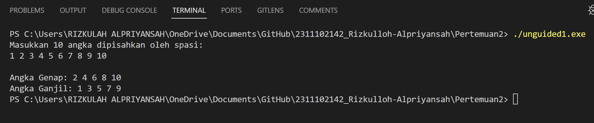

# <h1 align="center">Laporan Praktikum Modul ARRAY</h1>

<p align="center">Rizkulloh Alpriyansah</p>

## Dasar Teori

1. Tipe Data Primitif:
   Tipe data primitif merupakan tipe data dasar yang tersedia di dalam bahasa pemrograman. Tipe data ini mewakili nilai tunggal dan memiliki ukuran yang tetap.
   Contoh tipe data primitif termasuk integer (bilangan bulat), float (bilangan desimal), double (bilangan desimal dengan presisi ganda), char (karakter), dan bool (nilai kebenaran).
   Tipe data primitif digunakan untuk merepresentasikan data sederhana seperti angka, karakter, atau nilai kebenaran yang tidak memerlukan struktur yang kompleks.

2. Tipe Data Abstrak (ADT - Abstract Data Type):
   Tipe data abstrak merupakan tipe data yang didefinisikan oleh kumpulan operasi yang dapat dilakukan terhadap data tersebut, tanpa mengungkapkan bagaimana operasi tersebut diimplementasikan.
   ADT menyediakan antarmuka yang terstandarisasi untuk berinteraksi dengan data, memungkinkan pengguna untuk menggunakan operasi tersebut tanpa perlu mengetahui detail implementasinya.
   Contoh tipe data abstrak meliputi struktur data seperti stack, queue, linked list, dan tree, serta tipe data kompleks seperti bilangan kompleks atau matriks.

3. Tipe Data Koleksi:
   Tipe data koleksi digunakan untuk menyimpan sejumlah nilai atau objek dalam satu variabel. Ini memungkinkan pengelompokan data menjadi satu unit logis untuk mempermudah pengolahan data.
   Contoh tipe data koleksi termasuk array, vector (di C++), list, set, map, dan hash table.
   Tipe data koleksi memungkinkan pengguna untuk menyimpan dan mengelola data dalam jumlah yang besar dan beragam, serta memberikan akses cepat ke elemen-elemennya.

## Guided

### 1. [Program Input Array Tiga Dimensi]

```C++
#include <iostream>

using namespace std;
// PROGRAM INPUT ARRAY 3 DIMENSI By Rizkulloh dengan NIM 2311102142
int main()
{
    // Deklarasi array
    int arr[2][3][3];
    // Input elemen
    for (int x = 0; x < 2; x++)
    {
        for (int y = 0; y < 3; y++)
        {
            for (int z = 0; z < 3; z++)
            {
                cout << "Input Array[" << x << "][" << y << "][" << z << "] = ";
                cin >> arr[x][y][z];
            }
        }
        cout << endl;
    }
    // Output Array
    for (int x = 0; x < 2; x++)
    {
        for (int y = 0; y < 3; y++)
        {
            for (int z = 0; z < 3; z++)
            {
                cout << "Data Array[" << x << "][" << y << "][" << z << "] = " << arr[x][y][z] << endl;
            }
        }
    }
    cout << endl;
    // Tampilan array
    for (int x = 0; x < 2; x++)
    {
        for (int y = 0; y < 3; y++)
        {
            for (int z = 0; z < 3; z++)
            {
                cout << arr[x][y][z] << ends;
            }
            cout << endl;
        }
        cout << endl;
    }
}
```

->Program ini adalah sebuah program sederhana dalam bahasa C++ yang menggunakan array tiga dimensi dengan ukuran 2x3x3. Pengguna diminta untuk memasukkan nilai-nilai ke dalam array tersebut, dan setelah nilai-nilai dimasukkan, program langsung menampilkannya ke layar tanpa pesan tambahan, hanya menampilkan nilai-nilai array secara langsung. Ini memungkinkan pengguna untuk dengan mudah menginputkan dan melihat nilai-nilai dalam array tiga dimensi tanpa adanya proses tambahan yang kompleks.

### 2. [Program Mencari Nilai Maksimal pada Array]

```C++
#include <stdio.h>
#include <iostream>
// By Rizkulloh Dengan NIM 2311102142
using namespace std;

int main(){
    int maks, a, i = 1, lokasi;
    cout << "Masukkan panjang array: ";
    cin >> a;
    int array[a];
    cout << "Masukkan " << a << " angka\n";
    for (i = 0; i < a; i++)
        {
            cout << "Array ke-" << (i) << ": ";
            cin >> array[i];
        }
    maks = array[0];
    for (i = 0; i < a; i++)
        {
        if (array[i] > maks)
            {
                maks = array[i];
                lokasi = i;
            }
        }
    cout << "Nilai maksimum adalah " << maks << " berada di Array ke " << lokasi << endl;
}
```

->Program ini meminta pengguna untuk memasukkan panjang array dan nilai-nilai ke dalam array tersebut. Selanjutnya, program mencari nilai maksimum dari array tersebut dan menampilkan nilainya beserta lokasi di mana nilai maksimum tersebut ditemukan dalam array. Keseluruhan program berfungsi untuk mencari nilai maksimum dalam array satu dimensi yang telah dimasukkan oleh pengguna.

## Unguided

### 1. [Buatlah program untuk menampilkan Output seperti berikut dengan data yang diinputkan oleh user]

```C++
//Di buat oleh Rizkulloh Alpriyansah dengan nim 2311102142
#include <iostream>
using namespace std;

int main() {
    int angka_142[10];
    int angkaGenap_142[10];
    int angkaGanjil_142[10];
    int jmlGenap_142 = 0;
    int jmlGanjil_142 = 0;

    cout << "Masukkan 10 angka dipisahkan oleh spasi:\n";
    for (int i = 0; i < 10; ++i) {
        cin >> angka_142[i];
    }

    for (int i = 0; i < 10; ++i) {
        if (angka_142[i] % 2 == 0) {
            angkaGenap_142[jmlGenap_142] = angka_142[i];
            jmlGenap_142++;
        } else {
            angkaGanjil_142[jmlGanjil_142] = angka_142[i];
            jmlGanjil_142++;
        }
    }

    cout << "\nAngka Genap: ";
    for (int i = 0; i < jmlGenap_142; ++i) {
        cout << angkaGenap_142[i] << " ";
    }

    cout << "\nAngka Ganjil: ";
    for (int i = 0; i < jmlGanjil_142; ++i) {
        cout << angkaGanjil_142[i] << " ";
    }

    return 0;
}
```

#### Output:



## ->Penjelasan Program:

Program ini meminta pengguna untuk memasukkan 10 angka dan kemudian memisahkan angka-angka tersebut menjadi dua kelompok, yaitu angka genap dan angka ganjil. Program menggunakan array untuk menyimpan angka-angka tersebut serta array terpisah untuk angka genap dan ganjil.

Setelah semua angka dimasukkan, program melakukan iterasi melalui array angka dan memeriksa apakah setiap angka adalah genap atau ganjil. Jika angka adalah genap, maka akan disimpan dalam array angkaGenap; jika ganjil, maka akan disimpan dalam array angkaGanjil. Variabel jmlGenap dan jmlGanjil digunakan untuk melacak jumlah angka genap dan ganjil yang telah disimpan.

Setelah pemisahan selesai, program menampilkan kedua kelompok angka, terlebih dahulu angka genap kemudian angka ganjil.

## ->Kesimpulan

Program ini bertujuan untuk memisahkan angka-angka yang dimasukkan oleh pengguna menjadi dua kelompok: angka genap dan angka ganjil. Ini memberikan pengguna pemahaman tentang cara menggunakan array untuk menyimpan data yang berbeda jenis, dan bagaimana melakukan operasi sederhana seperti memisahkan data berdasarkan kriteria tertentu.

### 2. [Buatlah program Input array tiga dimensi (seperti pada guided) tetapi jumlah atau ukuran elemennya diinputkan oleh user]

```C++
// Dibuat oleh Rizkulloh Dengan NIM 2311102142
#include <iostream>
#include <string>

using namespace std;

// Struct untuk menyimpan nama dan nomor favorit
struct Biodata {
    string nama_142;
    int nomorFavorit_142;
};

// Class untuk merepresentasikan sebuah kendaraan
class Kendaraan {
private:
    string jenis_142;
    string merek_142;
    string model_142;
    int tahun_142;

public:
    // Constructor untuk menginisialisasi objek Kendaraan
    Kendaraan(string jns, string m, string mdl, int thn) : jenis_142(jns), merek_142(m), model_142(mdl), tahun_142(thn) {}

    // Metode untuk menampilkan informasi kendaraan
    void display() {
        cout << "Jenis Kendaraan: " << jenis_142 << endl;
        cout << "Merek: " << merek_142 << ", Model: " << model_142 << ", Tahun: " << tahun_142 << endl;
    }
};

int main() {
    // Membuat objek Biodata
    Biodata biodata_142;
    biodata_142.nama_142 = "Rizkulloh";
    biodata_142.nomorFavorit_142 = 7;

    // Menampilkan informasi biodata
    cout << "Biodata:" << endl;
    cout << "Nama: " << biodata_142.nama_142 << endl;
    cout << "Nomor Favorit: " << biodata_142.nomorFavorit_142 << endl;

    // Membuat objek Kendaraan
    Kendaraan mobil_142("Mobil", "Toyota", "Avanza", 2020);

    // Menampilkan informasi kendaraan
    cout << "\nInformasi Kendaraan:" << endl;
    mobil_142.display();

    return 0;
}
```

#### Output:


## ->Penjelasan Program:

Program di atas adalah program C++ yang menyimpan informasi tentang biodata seseorang (nama dan nomor favorit) dan detail kendaraan (jenis, merek, model, dan tahun). Program ini juga menampilkan informasi tersebut ke layar.

Pertama, kita mendefinisikan sebuah `struct` yang disebut `Biodata` untuk menyimpan nama dan nomor favorit. Kemudian, kita mendefinisikan sebuah `class` yang disebut `Kendaraan` untuk merepresentasikan kendaraan dengan atribut jenis, merek, model, dan tahun. Di dalam `main()` function, kita membuat objek `Biodata` dengan nama `biodata_142` dan mengisi informasinya dengan nama "Rizkulloh" dan nomor favorit 7. Selanjutnya, kita membuat objek `Kendaraan` dengan nama `mobil_142` dan mengisi informasinya dengan jenis "Mobil", merek "Toyota", model "Avanza", dan tahun 2020. Terakhir, program menampilkan informasi biodata dan informasi kendaraan ke layar.

## Penjelasan class dan struct

#### A.Struct:

1.Grupkan Data: struct adalah fitur dalam banyak bahasa pemrograman yang memungkinkan kita untuk mengelompokkan beberapa data bersama-sama. Biasanya, struct digunakan untuk menyimpan data yang terkait, tetapi tidak memiliki banyak metode atau fungsi-fungsi terkait.
2.Sifat Default Public: Dalam struct, secara default, semua anggota (variabel) adalah public, artinya kita bisa mengaksesnya dari luar struct tanpa pembatasan. Hal ini membuat struct lebih sederhana untuk digunakan dalam beberapa kasus.
3.Penggunaan yang Sederhana: Struct sering digunakan untuk menyimpan data tanpa tambahan metode atau fungsi-fungsi kompleks yang terkait. Mereka cocok untuk situasi di mana kamu hanya perlu mengelompokkan beberapa data bersama-sama tanpa memperhatikan encapsulation atau inheritance.

#### B.Class:

1.Pengelompokan Data dan Fungsi: class adalah fitur dalam pemrograman berorientasi objek yang memungkinkan kita untuk mengelompokkan data (variabel) dan fungsi (metode) bersama dalam satu unit. Ini membantu dalam pengorganisasian kode yang kompleks.
2.Encapsulation: Dalam class, kita bisa menentukan aksesibilitas data dan metode dengan menggunakan private, protected, dan public, sehingga kita bisa mengatur bagaimana data dan fungsi tersebut bisa diakses dari luar class. Ini membantu dalam menciptakan struktur yang lebih aman dan terstruktur.
3.Inheritance: Dengan menggunakan class, kita bisa menerapkan konsep inheritance, yang memungkinkan kita membuat class baru (child class) yang mewarisi atribut dan metode dari class yang sudah ada (parent class). Ini membantu dalam membangun hierarki objek yang fleksibel dan meminimalkan redundansi kode.
4.Polymorphism: Polymorphism memungkinkan objek untuk diakses dengan menggunakan antarmuka umum, bahkan jika objek tersebut berasal dari class yang berbeda. Ini memungkinkan penggunaan yang lebih fleksibel dan kode yang lebih mudah di-maintain.

### 3. [Buat dan jelaskan program menggunakan fungsi map dan jelaskan perbedaan dari array dengan map]

```C++
//Dibuat Oleh Rizkulloh Dengan NIM 2311102142
#include <iostream>
#include <map>
#include <string>

using namespace std;

int main() {
  // Membuat map untuk menyimpan nomor tiket dengan nama penumpang
  map<int, string> tiketBus_142;

  // Menambahkan data ke dalam map
  tiketBus_142[1] = "Alfi_142";
  tiketBus_142[2] = "Bayu_142";
  tiketBus_142[3] = "Cindy_142";
  tiketBus_142[4] = "Eve_142";
  tiketBus_142[5] = "Eva_142";

  // Menampilkan nomor tiket bus beserta nama penumpang
  cout << "Nomor Tiket Bus dan Nama Penumpang:" << endl;
  for (const auto& pair : tiketBus_142) {
      cout << "Nomor Tiket: " << pair.first << ", Nama Penumpang: " << pair.second << endl;
  }

  // Mengakses nama penumpang dengan nomor tiket tertentu
  int nomorTiket = 3;
  cout << "Nama Penumpang dengan Nomor Tiket " << nomorTiket << ": " << tiketBus_142[nomorTiket] << endl;

  return 0;
}
```

#### Output:


## ->Penjelasan Program:

Program ini menggunakan map<int, string> untuk membuat map yang akan menyimpan nomor tiket sebagai kunci dan nama penumpang sebagai nilai. Data penumpang ditambahkan ke dalam map menggunakan nomor tiket sebagai kunci dan nama penumpang sebagai nilai. Kemudian, program menampilkan semua nomor tiket bus beserta nama penumpang yang terdaftar dalam map, menggunakan loop for untuk mengiterasi setiap pasangan kunci-nilai dalam map. Terakhir, program mengakses nama penumpang dengan nomor tiket tertentu menggunakan operator []

## Perbedaan Array dengan Map:

1.  Penyimpanan Data: Array menyimpan data secara terurut berdasarkan indeks, sedangkan map menyimpan data dalam bentuk pasangan kunci-nilai yang tidak terurut.
2.  Akses Data: Untuk mengakses data dalam array, kita menggunakan indeks sebagai kunci. Sedangkan dalam map, kita menggunakan kunci yang bisa berupa tipe data apapun, tidak hanya integer.
3.  Ukuran: Ukuran array biasanya tetap, sedangkan ukuran map bisa berubah sesuai dengan jumlah elemen yang disimpan.
4.  Ketersediaan Fungsi: Map menyediakan berbagai fungsi yang memudahkan manipulasi data, seperti insert(), erase(), dan find(), yang tidak tersedia dalam array.

## ->Kesimpulan

Fleksibilitas: Map memberikan fleksibilitas dalam mengelola data, karena kita bisa menggunakan tipe data apa pun sebagai kunci dan nilai. Keuntungan dari Penggunaan Map: Dengan menggunakan map, kita dapat dengan mudah menyimpan dan mengakses data yang terkait satu sama lain, seperti dalam kasus ini, menyimpan nomor tiket dengan nama penumpang. Penamaan Variable: Penambahan "\_142" setelah nama variable (tiketBus_142) bertujuan untuk membedakan variable tersebut dari variable lain yang mungkin memiliki nama yang sama dalam konteks yang berbeda.

## Referensi

[1] Putri, Meidyan P., et al. ALGORITMA DAN STRUKTUR DATA. Edited by Putri, Meidyan P. CV WIDINA MEDIA UTAMA, 2022.

[2] Putra, Muhammad Taufik D., et al. BELAJAR DASAR PEMROGRAMAN DENGAN C++. Edited by Damayanti, Evi, CV WIDINA MEDIA UTAMA, 2022.
