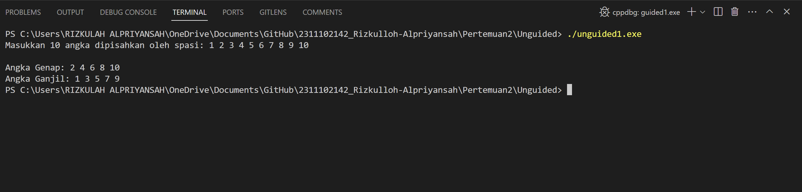

# <h1 align="center">Laporan Praktikum Modul ARRAY</h1>

<p align="center">Rizkulloh Alpriyansah</p>

## Dasar Teori

Array merupakan kumpulan variabel yang terstruktur, digunakan untuk menyimpan data dengan tipe yang serupa atau data-data yang disusun secara berurutan. Di dalamnya, setiap elemen memiliki tipe data yang serupa. Indeks digunakan untuk mengakses setiap elemen yang disimpan dalam array, sedangkan panjang atau length menyatakan jumlah total elemen yang tersimpan di dalamnya. Secara umum, terdapat tiga jenis tipe data array yang sering dikenal:

Array Satu Dimensi:
Array satu dimensi adalah kumpulan elemen yang disusun secara linear. Elemen-elemen ini dapat diakses menggunakan satu indeks. Keunggulan dari array satu dimensi adalah kemudahan penggunaan dan pembacaan. Contohnya, kita dapat menggunakan array Nilai[5] untuk menyimpan 5 nilai integer atau Nama[10] untuk menyimpan 10 nama string.

Array Dua Dimensi:
Array dua dimensi adalah struktur data yang memiliki dua dimensi, sering kali dijelaskan sebagai tabel dengan baris dan kolom. Elemen-elemen dalam array ini diakses menggunakan dua indeks yang mewakili posisi baris dan kolomnya. Array ini berguna untuk menyimpan data yang memerlukan pengaturan dua dimensi, seperti matriks. Sebagai contoh, kita dapat menggunakan array NilaiUjian[3][5] untuk menyimpan nilai ujian 3 siswa untuk 5 mata pelajaran yang berbeda.

Array Multidimensi:
Array multidimensi adalah struktur data yang memiliki lebih dari dua dimensi. Ini memungkinkan representasi data dengan lebih banyak tingkat hierarki dan kompleksitas. Array ini digunakan untuk menyimpan data yang memerlukan struktur yang lebih kompleks, seperti data spasial atau temporal. Contohnya, Warna[3][3][3] dapat digunakan untuk menyimpan data warna RGB untuk 3 objek, di mana setiap objek memiliki 3 bagian dan setiap bagian memiliki 3 warna yang berbeda.

## Guided

### 1. [Program Input Array Tiga Dimensi]

```C++
#include <iostream>

using namespace std;
// PROGRAM INPUT ARRAY 3 DIMENSI By Rizkulloh dengan NIM 2311102142
int main()
{
    // Deklarasi array
    int arr[2][3][3];
    // Input elemen
    for (int x = 0; x < 2; x++)
    {
        for (int y = 0; y < 3; y++)
        {
            for (int z = 0; z < 3; z++)
            {
                cout << "Input Array[" << x << "][" << y << "][" << z << "] = ";
                cin >> arr[x][y][z];
            }
        }
        cout << endl;
    }
    // Output Array
    for (int x = 0; x < 2; x++)
    {
        for (int y = 0; y < 3; y++)
        {
            for (int z = 0; z < 3; z++)
            {
                cout << "Data Array[" << x << "][" << y << "][" << z << "] = " << arr[x][y][z] << endl;
            }
        }
    }
    cout << endl;
    // Tampilan array
    for (int x = 0; x < 2; x++)
    {
        for (int y = 0; y < 3; y++)
        {
            for (int z = 0; z < 3; z++)
            {
                cout << arr[x][y][z] << ends;
            }
            cout << endl;
        }
        cout << endl;
    }
}
```

### -> Penjelasan Program

Program tersebut adalah contoh implementasi array 3 dimensi dalam C++. Array tersebut berukuran 2x3x3. Program meminta pengguna untuk memasukkan nilai untuk setiap elemen array dan kemudian mencetak kembali nilai-nilai tersebut dengan label indeks dan tanpa label indeks. Ini dilakukan menggunakan nested loop untuk mengakses setiap elemen array.

### 2. [Program Mencari Nilai Maksimal pada Array]

```C++
#include <stdio.h>
#include <iostream>
// By Rizkulloh Dengan NIM 2311102142
using namespace std;

int main(){
    int maks, a, i = 1, lokasi;
    cout << "Masukkan panjang array: ";
    cin >> a;
    int array[a];
    cout << "Masukkan " << a << " angka\n";
    for (i = 0; i < a; i++)
        {
            cout << "Array ke-" << (i) << ": ";
            cin >> array[i];
        }
    maks = array[0];
    for (i = 0; i < a; i++)
        {
        if (array[i] > maks)
            {
                maks = array[i];
                lokasi = i;
            }
        }
    cout << "Nilai maksimum adalah " << maks << " berada di Array ke " << lokasi << endl;
}
```

->

## Unguided

### 1. [Buatlah program untuk menampilkan Output seperti berikut dengan data yang diinputkan oleh user]


```C++
//Di buat oleh Rizkulloh Alpriyansah dengan nim 2311102142
#include <iostream>
using namespace std;

int main() {
    int angka_142[10];
    int angkaGenap_142[10];
    int angkaGanjil_142[10];
    int jmlGenap_142 = 0;
    int jmlGanjil_142 = 0;

    cout << "Masukkan 10 angka dipisahkan oleh spasi:\n";
    for (int i = 0; i < 10; ++i) {
        cin >> angka_142[i];
    }

    for (int i = 0; i < 10; ++i) {
        if (angka_142[i] % 2 == 0) {
            angkaGenap_142[jmlGenap_142] = angka_142[i];
            jmlGenap_142++;
        } else {
            angkaGanjil_142[jmlGanjil_142] = angka_142[i];
            jmlGanjil_142++;
        }
    }

    cout << "\nAngka Genap: ";
    for (int i = 0; i < jmlGenap_142; ++i) {
        cout << angkaGenap_142[i] << " ";
    }

    cout << "\nAngka Ganjil: ";
    for (int i = 0; i < jmlGanjil_142; ++i) {
        cout << angkaGanjil_142[i] << " ";
    }

    return 0;
}
```

#### Output:



## ->Penjelasan Program:

Program C++ di atas meminta pengguna untuk memasukkan 10 angka yang dipisahkan oleh spasi. Setelah menerima input, program memisahkan angka-angka tersebut menjadi dua array terpisah: satu untuk angka genap dan satu lagi untuk angka ganjil. Kemudian, program mencetak kedua array tersebut ke layar, menampilkan angka genap terlebih dahulu, diikuti oleh angka ganjil.

Berikut adalah kesimpulan singkat dari program tersebut:

1. Program meminta pengguna untuk memasukkan 10 angka.
2. Angka-angka tersebut disimpan dalam array `angka_142`.
3. Program memisahkan angka-angka tersebut menjadi dua array terpisah: `angkaGenap_142` untuk angka genap dan `angkaGanjil_142` untuk angka ganjil.
4. Jumlah angka genap dan ganjil disimpan dalam variabel `jmlGenap_142` dan `jmlGanjil_142`.
5. Program mencetak array angka genap dan ganjil ke layar.

## ->Kesimpulan

Program C++ tersebut meminta pengguna untuk memasukkan 10 angka, kemudian memisahkan angka-angka tersebut menjadi dua kategori: angka genap dan angka ganjil. Setelah itu, program mencetak kedua kategori angka tersebut ke layar.

### 2. [Buatlah program Input array tiga dimensi (seperti pada guided) tetapi jumlah atau ukuran elemennya diinputkan oleh user]

```C++
// Dibuat oleh Rizkulloh Dengan NIM 2311102142
#include <iostream>

using namespace std;

int main() {
    int x_142, y_142, z_142;

    // Meminta pengguna untuk memasukkan ukuran array
    cout << "Masukkan jumlah elemen untuk dimensi pertama: ";
    cin >> x_142;
    cout << "Masukkan jumlah elemen untuk dimensi kedua: ";
    cin >> y_142;
    cout << "Masukkan jumlah elemen untuk dimensi ketiga: ";
    cin >> z_142;

    // Deklarasi array tiga dimensi sesuai dengan ukuran yang dimasukkan pengguna
    int array3D[x_142][y_142][z_142];

    // Memasukkan nilai ke dalam array
    cout << "Masukkan elemen-elemen array:" << endl;
    for (int i = 0; i < x_142; ++i) {
        for (int j = 0; j < y_142; ++j) {
            for (int k = 0; k < z_142; ++k) {
                cout << "Masukkan nilai untuk elemen [" << i << "][" << j << "][" << k << "]: ";
                cin >> array3D[i][j][k];
            }
        }
    }

    // Menampilkan isi array
    cout << "Isi array:" << endl;
    for (int i = 0; i < x_142; ++i) {
        for (int j = 0; j < y_142; ++j) {
            for (int k = 0; k < z_142; ++k) {
                cout << array3D[i][j][k] << " ";
            }
            cout << endl;
        }
        cout << endl;
    }

    return 0;
}

```

#### Output:


## ->Penjelasan Program:

Program C++ di atas merupakan contoh penggunaan array tiga dimensi. Program meminta pengguna untuk memasukkan jumlah elemen untuk setiap dimensi array, kemudian membuat array tiga dimensi sesuai dengan ukuran yang dimasukkan. Setelah itu, program meminta pengguna untuk memasukkan nilai-nilai untuk setiap elemen array dan menampilkannya ke layar.

Penjelasan langkah demi langkah:

Pertama, program meminta pengguna untuk memasukkan jumlah elemen untuk masing-masing dimensi array.
Array tiga dimensi array3D dideklarasikan dengan ukuran yang dimasukkan pengguna.
Pengguna diminta untuk memasukkan nilai untuk setiap elemen array menggunakan tiga loop bersarang, masing-masing untuk dimensi pertama, kedua, dan ketiga.
Setelah semua nilai dimasukkan, program menampilkan isi array ke layar menggunakan loop bersarang.

## -> Kesimpulan

Program ini memperlihatkan cara menggunakan array tiga dimensi dalam bahasa pemrograman C++. Array tiga dimensi digunakan untuk menyimpan data dalam bentuk tiga dimensi, seperti dalam kasus ini, di mana data disusun dalam baris, kolom, dan lapisan. Program memungkinkan pengguna untuk memasukkan data ke dalam array dan menampilkan isi array tersebut.

### 3. [Buat dan jelaskan program menggunakan fungsi map dan jelaskan perbedaan dari array dengan map]

```C++
//Dibuat Oleh Rizkulloh Dengan NIM 2311102142
#include <iostream>
#include <climits>

using namespace std;

int main() {
    int size;

    // Meminta pengguna untuk memasukkan ukuran array
    cout << "Masukkan jumlah elemen dalam array: ";
    cin >> size;

    // Membuat array sesuai dengan ukuran yang dimasukkan pengguna
    int arr[size];

    // Meminta pengguna untuk memasukkan nilai-nilai array
    cout << "Masukkan nilai-nilai array:" << endl;
    for (int i = 0; i < size; ++i) {
        cout << "Nilai elemen ke-" << i + 1 << ": ";
        cin >> arr[i];
    }

    int choice;
    char repeat;

    do {
        // Menampilkan menu
        cout << "Pilih operasi yang ingin dilakukan:" << endl;
        cout << "1. Cari nilai maksimum" << endl;
        cout << "2. Cari nilai minimum" << endl;
        cout << "3. Cari nilai rata-rata" << endl;
        cout << "Pilihan: ";
        cin >> choice;

        // Proses sesuai dengan pilihan pengguna
        switch (choice) {
            case 1: {
                // Mencari nilai maksimum
                int maxVal = INT_MIN;
                for (int i = 0; i < size; ++i) {
                    if (arr[i] > maxVal) {
                        maxVal = arr[i];
                    }
                }
                cout << "Nilai maksimum dalam array: " << maxVal << endl;
                break;
            }
            case 2: {
                // Mencari nilai minimum
                int minVal = INT_MAX;
                for (int i = 0; i < size; ++i) {
                    if (arr[i] < minVal) {
                        minVal = arr[i];
                    }
                }
                cout << "Nilai minimum dalam array: " << minVal << endl;
                break;
            }
            case 3: {
                // Menghitung nilai rata-rata
                int sum = 0;
                for (int i = 0; i < size; ++i) {
                    sum += arr[i];
                }
                double average = static_cast<double>(sum) / size;
                cout << "Nilai rata-rata dari array: " << average << endl;
                break;
            }
            default:
                cout << "Pilihan tidak valid!" << endl;
        }

        cout << "Mau melakukan operasi lain? (y/n): ";
        cin >> repeat;
    } while (repeat == 'y' || repeat == 'Y');

    return 0;
}
```

#### Output:


## ->Penjelasan Program

Program C++ di atas merupakan program sederhana yang meminta pengguna untuk memasukkan ukuran array dan nilai-nilai dalam array tersebut. Kemudian, program memberikan pilihan kepada pengguna untuk melakukan operasi tertentu seperti mencari nilai maksimum, nilai minimum, atau nilai rata-rata dari elemen-elemen array.

Penjelasan langkah demi langkah:

1. Program meminta pengguna untuk memasukkan ukuran array.
2. Array arr dibuat dengan ukuran yang dimasukkan oleh pengguna.
3. Pengguna diminta untuk memasukkan nilai-nilai array.
4. Program memberikan pilihan kepada pengguna untuk memilih operasi yang ingin dilakukan.
5. Bergantung pada pilihan pengguna, program menjalankan proses yang sesuai menggunakan switch-case:
   Jika pengguna memilih 1, program mencari nilai maksimum dalam array.
   Jika pengguna memilih 2, program mencari nilai minimum dalam array.
   Jika pengguna memilih 3, program menghitung nilai rata-rata dari array.
   Jika pilihan tidak valid, program memberikan pesan kesalahan.
6. Setelah operasi selesai dilakukan, program meminta pengguna apakah ingin melakukan operasi lain atau tidak.
7. Jika pengguna memilih untuk melanjutkan, program akan kembali ke langkah 4. Jika tidak, program selesai.

## ->Kesimpulan

Program ini memungkinkan pengguna untuk memasukkan nilai-nilai ke dalam array dan melakukan operasi seperti mencari nilai maksimum, minimum, atau rata-rata dari elemen-elemen array. Pengguna dapat melakukan operasi berulang sesuai dengan keinginan mereka.

## Referensi

[1] Putri, Meidyan P., et al. ALGORITMA DAN STRUKTUR DATA. Edited by Putri, Meidyan P. CV WIDINA MEDIA UTAMA, 2022.

[2] Putra, Muhammad Taufik D., et al. BELAJAR DASAR PEMROGRAMAN DENGAN C++. Edited by Damayanti, Evi, CV WIDINA MEDIA UTAMA, 2022.
