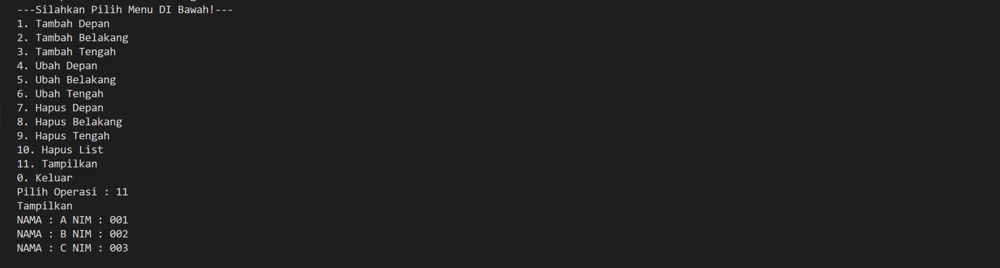

# <h1 align="center">Laporan Praktikum Modul 4 LINKED LIST CIRCULAR DAN NON CIRCULAR</h1>

<p align="center">Rizkulloh Alpriyansah</p>

## Dasar Teori

Linked List adalah data structure linear yang terdiri dari koleksi node, dimana setiap node memiliki data dan referensi ke node berikutnya dalam urutan. Ada dua jenis linked list: linked list circular dan linked list non-circular.
Linked list circular adalah jenis linked list yang memiliki struktur berulang, dimana node terakhir berhubungan dengan node pertama melalui pointer next. Hal ini memungkinkan traversal dalam bentuk berulang, yang sesuai untuk beberapa aplikasi seperti queue circular dan stack circular. Dalam linked list circular, pointer next node terakhir berhubungan dengan node pertama, membentuk struktur berulang.
Sedangkan linked list non-circular adalah data structure linear yang terdiri dari node yang memiliki data dan referensi ke node berikutnya dalam urutan. Berbeda dengan linked list circular, node terakhir dalam linked list non-circular tidak berhubungan dengan node pertama, dan pointer next node terakhir diset ke NULL, yang menunjukkan akhir dari list.
Perbedaan utama antara linked list circular dan linked list non-circular adalah cara node terakhir dihubungkan. Dalam linked list circular, node terakhir terhubung dengan node pertama, membentuk struktur berulang, sedangkan dalam linked list non-circular, node terakhir tidak terhubung dengan node apa pun, dan pointer next node terakhir diset ke NULL.
Kedua jenis linked list memiliki kelebihan dan kekurangan sendiri. Linked list circular sesuai untuk implikasi data structure berulang seperti queue circular dan stack circular, sementara linked list non-circular lebih sering digunakan untuk data structure linear seperti linked list single dan linked list double.

## Guided

### 1. [Linked List Non Circular]

```C++
#include <iostream>
using namespace std;
/// PROGRAM SINGLE LINKED LIST NON-CIRCULAR
// Deklarasi Struct Node
struct Node
{
    int data;
    Node *next;
};
Node *head;
Node *tail;
// Inisialisasi Node
void init()
{
    head = NULL;
    tail = NULL;
}
// Pengecekan
bool isEmpty()
{
    if (head == NULL)
        return true;
    else
        return false;
}
// Tambah Depan
void insertDepan(int nilai)
{
    // Buat Node baru
    Node *baru = new Node;
    baru->data = nilai;
    baru->next = NULL;
    if (isEmpty() == true)
    {
        head = tail = baru;
        tail->next = NULL;
    }
    else
    {
        baru->next = head;
        head = baru;
    }
}
// Tambah Belakang
void insertBelakang(int nilai)
{
    // Buat Node baru
    Node *baru = new Node;
    baru->data = nilai;
    baru->next = NULL;
    if (isEmpty() == true)
    {
        head = tail = baru;
        tail->next = NULL;
    }
    else
    {
        tail->next = baru;
        tail = baru;
    }
}
// Hitung Jumlah List
int hitungList()
{
    Node *hitung;
    hitung = head;
    int jumlah = 0;
    while (hitung != NULL)
    {
        jumlah++;
        hitung = hitung->next;
    }
    return jumlah;
}
// Tambah Tengah
void insertTengah(int data, int posisi)
{
    if (posisi < 1 || posisi > hitungList())
    {
        cout << "Posisi diluar jangkauan" << endl;
    }
    else if (posisi == 1)
    {
        cout << "Posisi bukan posisi tengah" << endl;
    }
    else
    {
        Node *baru, *bantu;
        baru = new Node();
        baru->data = data;
        // tranversing
        bantu = head;
        int nomor = 1;
        while (nomor < posisi - 1)
        {
            bantu = bantu->next;
            nomor++;
        }
        baru->next = bantu->next;
        bantu->next = baru;
    }
}
// Hapus Depan
void hapusDepan()
{
    Node *hapus;
    if (isEmpty() == false)
    {
        if (head->next != NULL)
        {
            hapus = head;
            head = head->next;
            delete hapus;
        }
        else
        {
            head = tail = NULL;
        }
    }
    else
    {
        cout << "List kosong!" << endl;
    }
}
// Hapus Belakang
void hapusBelakang()
{
    Node *hapus;
    Node *bantu;
    if (isEmpty() == false)
    {
        if (head != tail)
        {
            hapus = tail;
            bantu = head;
            while (bantu->next != tail)
            {
                bantu = bantu->next;
            }
            tail = bantu;
            tail->next = NULL;
            delete hapus;
        }
        else
        {
            head = tail = NULL;
        }
    }

    else
    {
        cout << "List kosong!" << endl;
    }
}
// Hapus Tengah
void hapusTengah(int posisi)
{
    Node *bantu, *hapus, *sebelum;
    if (posisi < 1 || posisi > hitungList())
    {
        cout << "Posisi di luar jangkauan" << endl;
    }
    else if (posisi == 1)
    {
        cout << "Posisi bukan posisi tengah" << endl;
    }
    else
    {
        int nomor = 1;
        bantu = head;
        while (nomor <= posisi)
        {
            if (nomor == posisi - 1)
            {
                sebelum = bantu;
            }
            if (nomor == posisi)
            {
                hapus = bantu;
            }
            bantu = bantu->next;
            nomor++;
        }
        sebelum->next = bantu;
        delete hapus;
    }
}
// Ubah Depan
void ubahDepan(int data)
{
    if (isEmpty() == 0)
    {
        head->data = data;
    }
    else
    {
        cout << "List masih kosong!" << endl;
    }
}
// Ubah Tengah
void ubahTengah(int data, int posisi)
{
    Node *bantu;
    if (isEmpty() == 0)
    {
        if (posisi < 1 || posisi > hitungList())
        {
            cout << "Posisi di luar jangkauan" << endl;
        }
        else if (posisi == 1)
        {
        }
        else
        {
            cout << "Posisi bukan posisi tengah" << endl;
            bantu = head;
            int nomor = 1;
            while (nomor < posisi)
            {
                bantu = bantu->next;
                nomor++;
            }
            bantu->data = data;
        }
    }
    else
    {
        cout << "List masih kosong!" << endl;
    }
}
// Ubah Belakang
void ubahBelakang(int data)
{
    if (isEmpty() == 0)
    {
        tail->data = data;
    }
    else
    {
        cout << "List masih kosong!" << endl;
    }
}
// Hapus List
void clearList()
{
    Node *bantu, *hapus;
    bantu = head;
    while (bantu != NULL)
    {
        hapus = bantu;
        bantu = bantu->next;
        delete hapus;
    }
    head = tail = NULL;
    cout << "List berhasil terhapus!" << endl;
}
// Tampilkan List
void tampil()
{
    Node *bantu;
    bantu = head;
    if (isEmpty() == false)
    {
        while (bantu != NULL)
        {
            cout << bantu->data << ends;
            bantu = bantu->next;
        }
        cout << endl;
    }
    else
    {
        cout << "List masih kosong!" << endl;
    }
}
int main()
{
    init();
    insertDepan(3);
    tampil();
    insertBelakang(5);
    tampil();
    insertDepan(2);
    tampil();
    insertDepan(1);
    tampil();
    hapusDepan();
    tampil();
    hapusBelakang();
    tampil();
    insertTengah(7, 2);
    tampil();
    hapusTengah(2);
    tampil();
    ubahDepan(1);
    tampil();
    ubahBelakang(8);
    tampil();
    ubahTengah(11, 2);
    tampil();
    return 0;
}
```

### -> Penjelasan Program

Program ini adalah contoh implementasi Linked List Non-Circular di C++. Linked List adalah data structure linear yang terdiri dari node yang terhubung secara berurutan. Program ini mendemonstrasikan beberapa operasi yang dapat dilakukan pada Linked List, seperti menambahkan node di depan, di belakang, dan di tengah, menghapus node di depan, di belakang, dan di tengah, serta mengubah data node di depan dan di belakang. Program juga menampilkan isi Linked List dan menghapus semua node pada Linked List.

### 2. [ Linked List Circular]

```C++
#include <iostream>
using namespace std;

// Deklarasi Struct Node
struct Node
{
    string data;
    Node* next;
};

Node* head, * tail, * baru, * bantu, * hapus;

void init()
{
    head = NULL;
    tail = head;
}

// Pengecekan
int isEmpty()
{
    if (head == NULL)
        return 1; // true
    else
        return 0; // false
}

// Buat Node Baru
void buatNode(string data)
{
    baru = new Node;
    baru->data = data;
    baru->next = NULL;
}

// Hitung List
int hitungList()
{
    bantu = head;
    int jumlah = 0;
    while (bantu != NULL)
    {
        jumlah++;
        bantu = bantu->next;
    }
    return jumlah;
}

// Tambah Depan
void insertDepan(string data)
{
    // Buat Node baru
    buatNode(data);

    if (isEmpty() == 1)
    {
        head = baru;
        tail = head;
        baru->next = head;
    }
    else
    {
        while (tail->next != head)
        {
            tail = tail->next;
        }
        baru->next = head;
        head = baru;
        tail->next = head;
    }
}

// Tambah Belakang
void insertBelakang(string data)
{
    // Buat Node baru
    buatNode(data);

    if (isEmpty() == 1)
    {
        head = baru;
        tail = head;
        baru->next = head;
    }
    else
    {
        while (tail->next != head)
        {
            tail = tail->next;
        }
        tail->next = baru;
        baru->next = head;
    }
}

// Tambah Tengah
void insertTengah(string data, int posisi)
{
    if (isEmpty() == 1)
    {
        head = baru;
        tail = head;
        baru->next = head;
    }
    else
    {
        baru->data = data;
        // transversing
        int nomor = 1;
        bantu = head;
        while (nomor < posisi - 1)
        {
            bantu = bantu->next;
            nomor++;
        }
        baru->next = bantu->next;
        bantu->next = baru;
    }
}

// Hapus Depan
void hapusDepan()
{
    if (isEmpty() == 0)
    {
        hapus = head;
        tail = head;
        if (hapus->next == head)
        {
            head = NULL;
            tail = NULL;
            delete hapus;
        }
        else
        {
            while (tail->next != hapus)
            {
                tail = tail->next;
            }
            head = head->next;
            tail->next = head;
            hapus->next = NULL;
            delete hapus;
        }
    }
    else
    {
        cout << "List masih kosong!" << endl;
    }
}

// Hapus Belakang
void hapusBelakang()
{
    if (isEmpty() == 0)
    {
        hapus = head;
        tail = head;
        if (hapus->next == head)
        {
            head = NULL;
            tail = NULL;
            delete hapus;
        }
        else
        {
            while (hapus->next != head)
            {
                hapus = hapus->next;
            }
            while (tail->next != hapus)
            {
                tail = tail->next;
            }
            tail->next = head;
            hapus->next = NULL;
            delete hapus;
        }
    }
    else
    {
        cout << "List masih kosong!" << endl;
    }
}

// Hapus Tengah
void hapusTengah(int posisi)
{
    if (isEmpty() == 0)
    {
        // transversing
        int nomor = 1;
        bantu = head;
        while (nomor < posisi - 1)
        {
            bantu = bantu->next;
            nomor++;
        }
        hapus = bantu->next;
        bantu->next = hapus->next;
        delete hapus;
    }
    else
    {
        cout << "List masih kosong!" << endl;
    }
}

// Hapus List
void clearList()
{
    if (head != NULL)
    {
        hapus = head->next;
        while (hapus != head)
        {
            bantu = hapus->next;
            delete hapus;
            hapus = bantu;
        }
        delete head;
        head = NULL;
    }
    cout << "List berhasil terhapus!" << endl;
}

// Tampilkan List
void tampil()
{
    if (isEmpty() == 0)
    {
        tail = head;
        do
        {
            cout << tail->data << ends;
            tail = tail->next;
        } while (tail != head);
        cout << endl;
    }
    else
    {
        cout << "List masih kosong!" << endl;
    }
}

int main()
{
    init();
    insertDepan("Ayam");
    tampil();
    insertDepan("Bebek");
    tampil();
    insertBelakang("Cicak");
    tampil();
    insertBelakang("Domba");
    tampil();
    hapusBelakang();
    tampil();
    hapusDepan();
    tampil();
    insertTengah("Sapi", 2);
    tampil();
    hapusTengah(2);
    tampil();
    return 0;
}
```

### ->Penjelasan

Program ini menggunakan struct Node untuk membuat node baru dengan data dan pointer ke node selanjutnya. Fungsi isEmpty() digunakan untuk mengecek apakah Linked List Non-Circular kosong atau tidak. Fungsi insertDepan(), insertBelakang(), dan insertTengah() digunakan untuk menambahkan node baru di depan, di belakang, dan di tengah Linked List Non-Circular. Fungsi hapusDepan(), hapusBelakang(), dan hapusTengah() digunakan untuk menghapus node di depan, di belakang, dan di tengah Linked List Non-Circular. Fungsi tampil() digunakan untuk menampilkan isi Linked List Non-Circular.

## Unguided

### 1. [Soal mengenai Single Linked List]

```C++
// Dibuat Oleh Rizkulloh Dengan NIM 2311102142
#include <iostream>
#include <string>

using namespace std;

struct Node_142
{
    string nama_142;
    string nim_142;
    Node_142 *next_142;
};

void tambahDepan_142(Node_142 **head_142, string nama_142, string nim_142)
{
    Node_142 *newNode_142 = new Node_142;
    newNode_142->nama_142 = nama_142;
    newNode_142->nim_142 = nim_142;
    newNode_142->next_142 = *head_142;
    *head_142 = newNode_142;
}

void tambahBelakang_142(Node_142 **head_142, string nama_142, string nim_142)
{
    Node_142 *newNode_142 = new Node_142;
    newNode_142->nama_142 = nama_142;
    newNode_142->nim_142 = nim_142;
    newNode_142->next_142 = NULL;

    if (*head_142 == NULL)
    {
        *head_142 = newNode_142;
    }
    else
    {
        Node_142 *current_142 = *head_142;
        while (current_142->next_142 != NULL)
        {
            current_142 = current_142->next_142;
        }
        current_142->next_142 = newNode_142;
    }
}

void tambahTengah_142(Node_142 **head_142, string nama_142, string nim_142, int posisi_142)
{
    Node_142 *newNode_142 = new Node_142;
    newNode_142->nama_142 = nama_142;
    newNode_142->nim_142 = nim_142;

    if (posisi_142 == 1)
    {
        tambahDepan_142(head_142, nama_142, nim_142);
    }
    else
    {
        Node_142 *current_142 = *head_142;
        for (int i = 1; i < posisi_142 - 1 && current_142 != NULL; i++)
        {
            current_142 = current_142->next_142;
        }
        if (current_142 == NULL)
        {
            cout << "Posisi tidak valid" << endl;
            return;
        }
        newNode_142->next_142 = current_142->next_142;
        current_142->next_142 = newNode_142;
    }
}

void ubahDepan_142(Node_142 **head_142, string nama_142_lama, string nim_142_lama, string nama_142_baru, string nim_142_baru)
{
    Node_142 *current_142 = *head_142;
    while (current_142 != NULL && (current_142->nama_142 != nama_142_lama || current_142->nim_142 != nim_142_lama))
    {
        current_142 = current_142->next_142;
    }

    if (current_142 == NULL)
    {
        cout << "Data tidak ditemukan" << endl;
    }
    else
    {
        current_142->nama_142 = nama_142_baru;
        current_142->nim_142 = nim_142_baru;
        cout << "Data (" << nama_142_lama << " " << nim_142_lama << ") telah diganti dengan data (" << nama_142_baru << " " << nim_142_baru << ")" << endl;
    }
}

void ubahBelakang_142(Node_142 **head_142, string nama_142_lama, string nim_142_lama, string nama_142_baru, string nim_142_baru)
{
    if (*head_142 == NULL)
    {
        cout << "List kosong" << endl;
        return;
    }

    Node_142 *current_142 = *head_142;
    Node_142 *prev_142 = NULL;

    // Mencari node terakhir
    while (current_142->next_142 != NULL)
    {
        prev_142 = current_142;
        current_142 = current_142->next_142;
    }

    // Memeriksa apakah nilai node terakhir sesuai dengan nilai yang ingin diubah
    if (current_142->nama_142 == nama_142_lama && current_142->nim_142 == nim_142_lama)
    {
        // Mengubah nilai node terakhir
        current_142->nama_142 = nama_142_baru;
        current_142->nim_142 = nim_142_baru;
        cout << "Data (" << nama_142_lama << " " << nim_142_lama << ") telah diganti dengan data (" << nama_142_baru << " " << nim_142_baru << ")" << endl;
    }
    else
    {
        cout << "Data tidak ditemukan" << endl;
    }
}

void ubahTengah_142(Node_142 **head_142, string nama_142_lama, string nim_142_lama, string nama_142_baru, string nim_142_baru, int posisi_142)
{
    Node_142 *current_142 = *head_142;
    for (int i = 1; i < posisi_142 && current_142 != NULL; i++)
    {
        current_142 = current_142->next_142;
    }

    if (current_142 == NULL || current_142->next_142 == NULL)
    {
        cout << "Posisi tidak valid" << endl;
        return;
    }

    if (current_142->next_142->nama_142 == nama_142_lama && current_142->next_142->nim_142 == nim_142_lama)
    {
        current_142->next_142->nama_142 = nama_142_baru;
        current_142->next_142->nim_142 = nim_142_baru;
        cout << "Data (" << current_142->next_142->nama_142 << " " << current_142->next_142->nim_142 << ") telah diganti dengan data (" << nama_142_baru << " " << nim_142_baru << ")" << endl;
    }
    else
    {
        cout << "Data tidak ditemukan" << endl;
    }
}

void hapusDepan_142(Node_142 **head_142)
{
    if (*head_142 == NULL)
    {
        cout << "List sudah kosong" << endl;
        return;
    }
    Node_142 *current_142 = *head_142;
    *head_142 = current_142->next_142;
    delete current_142;
}

void hapusBelakang_142(Node_142 **head_142)
{
    if (*head_142 == NULL)
    {
        cout << "List sudah kosong" << endl;
        return;
    }
    Node_142 *current_142 = *head_142;
    Node_142 *prev_142 = NULL;
    while (current_142->next_142 != NULL)
    {
        prev_142 = current_142;
        current_142 = current_142->next_142;
    }
    if (prev_142 != NULL)
    {
        prev_142->next_142 = NULL;
    }
    else
    {
        *head_142 = NULL;
    }
    delete current_142;
}

void hapusTengah_142(Node_142 **head_142, int posisi_142)
{
    if (*head_142 == NULL)
    {
        cout << "List sudah kosong" << endl;
        return;
    }
    Node_142 *current_142 = *head_142;
    Node_142 *prev_142 = NULL;
    for (int i = 1; current_142 != NULL && i < posisi_142; i++)
    {
        prev_142 = current_142;
        current_142 = current_142->next_142;
    }
    if (current_142 == NULL)
    {
        cout << "Posisi tidak valid" << endl;
        return;
    }
    if (prev_142 != NULL)
    {
        prev_142->next_142 = current_142->next_142;
    }
    else
    {
        *head_142 = current_142->next_142;
    }
    delete current_142;
}

void hapusList_142(Node_142 **head_142)
{
    Node_142 *current_142 = *head_142;
    while (current_142 != NULL)
    {
        Node_142 *temp_142 = current_142;
        current_142 = current_142->next_142;
        delete temp_142;
    }
    *head_142 = NULL;
}

void tampilData_142(Node_142 *head_142)
{
    Node_142 *current_142 = head_142;
    while (current_142 != NULL)
    {
        cout << "NAMA : " << current_142->nama_142 << " \tNIM : " << current_142->nim_142 << endl;
        current_142 = current_142->next_142;
    }
}

int main()
{
    Node_142 *head_142 = NULL;

    int pilihan_142;
    string nama_142, nim_142, nama_142_baru, nim_142_baru;
    int posisi_142;

    do
    {
        cout << "---Silahkan Pilih Menu DI Bawah!---" << endl;
        cout << "1. Tambah Depan" << endl;
        cout << "2. Tambah Belakang" << endl;
        cout << "3. Tambah Tengah" << endl;
        cout << "4. Ubah Depan" << endl;
        cout << "5. Ubah Belakang" << endl;
        cout << "6. Ubah Tengah" << endl;
        cout << "7. Hapus Depan" << endl;
        cout << "8. Hapus Belakang" << endl;
        cout << "9. Hapus Tengah" << endl;
        cout << "10. Hapus List" << endl;
        cout << "11. Tampilkan" << endl;
        cout << "0. Keluar" << endl;
        cout << "Pilih Operasi : ";
        cin >> pilihan_142;

        switch (pilihan_142)
        {
        case 1:
            cout << "Tambah Depan" << endl;
            cout << "Masukkan Nama : ";
            cin >> nama_142;
            cout << "Masukkan NIM : ";
            cin >> nim_142;
            tambahDepan_142(&head_142, nama_142, nim_142);
            cout << "Data " << nama_142 << " Berhasil Ditambahkan!";
            cout << endl;
            break;
        case 2:
            cout << "Tambah Belakang" << endl;
            cout << "Masukkan Nama : ";
            cin >> nama_142;
            cout << "Masukkan NIM : ";
            cin >> nim_142;
            tambahBelakang_142(&head_142, nama_142, nim_142);
            cout << "Data " << nama_142 << " Berhasil Ditambahkan!";
            cout << endl;
            break;
        case 3:
            cout << "Tambah Tengah" << endl;
            cout << "Masukkan Nama : ";
            cin >> nama_142;
            cout << "Masukkan NIM : ";
            cin >> nim_142;
            cout << "Masukkan Posisi : ";
            cin >> posisi_142;
            tambahTengah_142(&head_142, nama_142, nim_142, posisi_142);
            cout << "Data " << nama_142 << " Berhasil Ditambahkan Pada Posisi " << posisi_142;
            cout << endl;
            break;
        case 4:
            cout << "Ubah Depan" << endl;
            cout << "Masukkan Nama Lama : ";
            cin >> nama_142;
            cout << "Masukkan NIM Lama : ";
            cin >> nim_142;
            cout << "Masukkan Nama Baru : ";
            cin >> nama_142_baru;
            cout << "Masukkan NIM Baru : ";
            cin >> nim_142_baru;
            ubahDepan_142(&head_142, nama_142, nim_142, nama_142_baru, nim_142_baru);
            cout << "Data " << nama_142 << " Telah Di Ganti Dengan Data " << nama_142_baru;
            cout << endl;
            break;
        case 5:
            cout << "Ubah Belakang" << endl;
            cout << "Ubah Depan" << endl;
            cout << "Masukkan Nama Lama : ";
            cin >> nama_142;
            cout << "Masukkan NIM Lama : ";
            cin >> nim_142;
            cout << "Masukkan Nama Baru : ";
            cin >> nama_142_baru;
            cout << "Masukkan NIM Baru : ";
            cin >> nim_142_baru;
            ubahBelakang_142(&head_142, nama_142, nim_142, nama_142_baru, nim_142_baru);
            cout << "Data " << nama_142 << " Telah Di Ganti Dengan Data " << nama_142_baru;
            cout << endl;
            break;

        case 6:
            cout << "Ubah Tengah" << endl;
            cout << "Masukkan Nama Lama : ";
            cin >> nama_142;
            cout << "Masukkan NIM Lama : ";
            cin >> nim_142;
            cout << "Masukkan Nama Baru : ";
            cin >> nama_142_baru;
            cout << "Masukkan NIM Baru : ";
            cin >> nim_142_baru;
            cout << "Masukkan Posisi : ";
            cin >> posisi_142;
            ubahTengah_142(&head_142, nama_142, nim_142, nama_142_baru, nim_142_baru, posisi_142);
            cout << "Data " << nama_142 << " Telah Di Ganti Dengan Data " << nama_142_baru;
            cout << endl;
            break;
        case 7: // Data (nama mahasiswa yang dihapus) berhasil dihapus
            cout << "Hapus Depan" << endl;
            hapusDepan_142(&head_142);
            cout << "Data Berhasil DIhapus!";
            cout << endl;
            break;
        case 8:
            cout << "Hapus Belakang" << endl;
            hapusBelakang_142(&head_142);
            cout << "Data Berhasil DIhapus!";
            cout << endl;
            break;
        case 9:
            cout << "Hapus Tengah" << endl;
            cout << "Masukkan Posisi : ";
            cin >> posisi_142;
            hapusTengah_142(&head_142, posisi_142);
            cout << "Data Berhasil DIhapus Pada Posisi " << posisi_142;
            cout << endl;
            ;
            break;
        case 10:
            cout << "Hapus List" << endl;
            hapusList_142(&head_142);
            cout << "Data Berhasil DIhapus!";
            cout << endl;
            break;
        case 11:
            cout << "Tampilkan" << endl;
            tampilData_142(head_142);
            cout << endl;
            break;
        case 0:
            cout << "Keluar" << endl;
            return 0;
        }
    } while (pilihan_142 != 0);

    return 0;
}
```

#### Output:





## ->Penjelasan Program:

## ->Kesimpulan

## Referensi

[1] Putri, Meidyan P., et al. ALGORITMA DAN STRUKTUR DATA. Edited by Putri, Meidyan P. CV WIDINA MEDIA UTAMA, 2022.

[2] Putra, Muhammad Taufik D., et al. BELAJAR DASAR PEMROGRAMAN DENGAN C++. Edited by Damayanti, Evi, CV WIDINA MEDIA UTAMA, 2022.

[3] Karumanchi, N. (2016). Data Structures and algorithms made easy: Concepts, problems, Interview Questions. CareerMonk Publications
