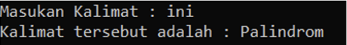
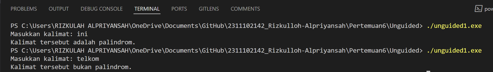
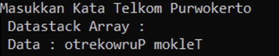
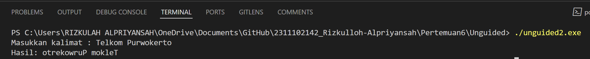

# <h1 align="center">Laporan Praktikum MODUL VI STACK</h1>

<p align="center">Rizkulloh Alpriyansah</p>

## Dasar Teori

1. Definisi:

   - Stack adalah struktur data yang digunakan untuk menyimpan dan mengatur data dengan prinsip Last In, First Out (LIFO). Dalam stack, elemen terakhir yang dimasukkan (push) akan menjadi elemen pertama yang diambil (pop). Operasi push digunakan untuk menambahkan elemen ke dalam stack, sementara operasi pop digunakan untuk menghapus elemen teratas dari stack.

   Stack dalam pemrograman C++ umumnya diimplementasikan menggunakan tipe data struktur atau kelas. Setiap stack biasanya memiliki dua operasi utama, yaitu push dan pop, serta beberapa operasi tambahan seperti peek (untuk melihat elemen teratas tanpa menghapusnya) dan isEmpty (untuk memeriksa apakah stack kosong).

2. Representasi:
   - Stack dapat direpresentasikan secara fisik sebagai tumpukan buku yang diletakkan satu per satu. Buku terakhir yang diletakkan akan menjadi yang paling atas dan akan diambil terlebih dahulu.
3. Operasi Dasar pada Stack:

   a. Push (Penyisipan):

   - Operasi untuk menambahkan elemen baru ke dalam stack.
   - Proses: Elemen baru dimasukkan ke dalam stack dan menjadi elemen teratas.
   - Contoh: Jika kita memiliki stack kosong dan menambahkan elemen A, maka A akan menjadi elemen teratas stack.

   b. Pop (Penghapusan):

   - Operasi untuk menghapus elemen teratas dari stack.
   - Proses: Elemen teratas stack dihapus, dan elemen di bawahnya menjadi elemen teratas.
   - Contoh: Jika kita memiliki stack dengan elemen A, B, dan C, maka setelah operasi Pop dilakukan, elemen teratas C akan dihapus, dan elemen teratas akan menjadi B.

   c. Top (Pengecekan Elemen Teratas):

   - Operasi untuk mengakses nilai dari elemen teratas stack tanpa menghapusnya.
   - Proses: Mengembalikan nilai dari elemen teratas stack.
   - Contoh: Jika kita memiliki stack dengan elemen A, B, dan C, operasi Top akan mengembalikan nilai C.

   d. isEmpty (Pengecekan Kehabisan Elemen):

   - Operasi untuk memeriksa apakah stack kosong atau tidak.
   - Proses: Mengembalikan nilai true jika stack kosong, dan false jika tidak.
   - Contoh: Jika stack kosong, operasi isEmpty akan mengembalikan nilai true.

   e. Size (Ukuran Stack):

   - Operasi untuk mengembalikan jumlah elemen yang ada dalam stack.
   - Proses: Menghitung jumlah elemen dalam stack.
   - Contoh: Jika kita memiliki stack dengan elemen A, B, dan C, operasi Size akan mengembalikan nilai 3.

4. Implementasi:
   - Stack dapat diimplementasikan menggunakan struktur data seperti array atau linked list. Dalam implementasi menggunakan array, perlu diperhatikan kapasitas maksimum stack untuk menghindari overflow. Sedangkan dalam implementasi menggunakan linked list, penambahan dan penghapusan elemen dapat dilakukan dengan mudah tanpa memperhatikan kapasitas maksimum.
5. Contoh Aplikasi:
   - Stack banyak digunakan dalam berbagai aplikasi, seperti dalam pemanggilan fungsi dalam bahasa pemrograman, evaluasi ekspresi aritmatika dalam notasi postfix, pelacakan navigasi dalam web browser, dan manajemen tumpukan pesan dalam sistem operasi.
6. Analisis Kompleksitas:
   - Operasi Push, Pop, Top, dan isEmpty pada stack biasanya memiliki kompleksitas waktu O(1), karena operasi tersebut hanya melibatkan perubahan pada elemen teratas stack.
   - Kompleksitas operasi Size bergantung pada cara implementasi. Pada implementasi dengan array, kompleksitasnya O(1), sedangkan pada implementasi dengan linked list, kompleksitasnya adalah O(n), di mana n adalah jumlah elemen dalam stack.

Dengan pemahaman yang mendalam tentang dasar teori stack, pengguna dapat menggunakan dan mengimplementasikannya secara efisien dalam berbagai aplikasi komputasi.

## Guided

### 1. [Guided I]

```C++
//Dibuat oleh Rizkulloh Alpriyansah dengan NIM 2311102142
#include <iostream>
using namespace std;
string arrayBuku[5];
int maksimal = 5, top = 0;
bool isFull()
{
    return (top == maksimal);
}
bool isEmpty()
{
    return (top == 0);
}
void pushArrayBuku(string data)
{
    if (isFull())
    {
        cout << "Data telah penuh" << endl;
    }
    else
    {
        arrayBuku[top] = data;
        top++;
    }
}
void popArrayBuku()
{
    if (isEmpty())
    {
        cout << "Tidak ada data yang dihapus" << endl;
    }
    else
    {
        arrayBuku[top - 1] = "";
        top--;
    }
}
void peekArrayBuku(int posisi)
{
    if (isEmpty())
    {
        cout << "Tidak ada data yang bisa dilihat" << endl;
    }
    else
    {
        int index = top;
        for (int i = 1; i <= posisi; i++)
        {
            index--;
        }
        cout << "Posisi ke " << posisi << " adalah " << arrayBuku[index] << endl;
    }
}
int countStack()
{
    return top;
}
void changeArrayBuku(int posisi, string data)
{
    if (posisi > top)
    {
        cout << "Posisi melebihi data yang ada" << endl;
    }
    else
    {
        int index = top;
        for (int i = 1; i <= posisi; i++)
        {
            index--;
        }
        arrayBuku[index] = data;
    }
}
void destroyArraybuku()
{
    for (int i = top; i >= 0; i--)
    {
        arrayBuku[i] = "";
    }
    top = 0;
}
void cetakArrayBuku()
{
    if (isEmpty())
    {
        cout << "Tidak ada data yang dicetak" << endl;
    }
    else
    {
        for (int i = top - 1; i >= 0; i--)
        {
            cout << arrayBuku[i] << endl;
        }
    }
}
int main()
{
    pushArrayBuku("Kalkulus");
    pushArrayBuku("Struktur Data");
    pushArrayBuku("Matematika Diskrit");
    pushArrayBuku("Dasar Multimedia");
    pushArrayBuku("Inggris");
    cetakArrayBuku();
    cout << "\n";
    cout << "Apakah data stack penuh? " << isFull() << endl;
    cout << "Apakah data stack kosong? " << isEmpty() << endl;
    peekArrayBuku(2);
    popArrayBuku();
    cout << "Banyaknya data = " << countStack() << endl;
    changeArrayBuku(2, "Bahasa Jerman");
    cetakArrayBuku();
    cout << "\n";
    destroyArraybuku();
    cout << "Jumlah data setelah dihapus: " << top << endl;
    cetakArrayBuku();
    return 0;
}
```

### ->Penjelasan

Program yang diberikan adalah implementasi stack menggunakan array dalam bahasa pemrograman C++. Program ini memiliki fungsi-fungsi dasar dari stack seperti push (menambahkan elemen), pop (menghapus elemen), peek (mengakses elemen tanpa menghapus), isEmpty (memeriksa apakah stack kosong), serta beberapa fungsi tambahan seperti countStack (menghitung jumlah elemen dalam stack), changeArrayBuku (mengubah nilai elemen pada posisi tertentu), destroyArrayBuku (menghapus semua elemen dalam stack), dan cetakArrayBuku (mencetak semua elemen dalam stack).

Berikut adalah penjelasan detail dari masing-masing fungsi dalam program:

1. isFull():

   - Fungsi ini memeriksa apakah stack sudah penuh atau belum.
   - Jika nilai top (indeks posisi teratas) sama dengan maksimal (ukuran maksimal stack), maka stack dianggap penuh dan fungsi ini akan mengembalikan nilai true. Jika tidak, fungsi ini akan mengembalikan nilai false.

2. isEmpty():

   - Fungsi ini memeriksa apakah stack kosong atau tidak.
   - Jika nilai top (indeks posisi teratas) sama dengan 0, maka stack dianggap kosong dan fungsi ini akan mengembalikan nilai true. Jika tidak, fungsi ini akan mengembalikan nilai false.

3. pushArrayBuku(string data):

   - Fungsi ini menambahkan elemen baru ke dalam stack.
   - Jika stack sudah penuh, program akan mencetak pesan "Data telah penuh". Jika tidak, data akan ditambahkan ke dalam arrayBuku pada posisi top dan nilai top akan ditingkatkan.

4. popArrayBuku():

   - Fungsi ini menghapus elemen teratas dari stack.
   - Jika stack kosong, program akan mencetak pesan "Tidak ada data yang dihapus". Jika tidak, elemen teratas stack akan dihapus dengan mengosongkan nilai arrayBuku pada posisi top-1 dan nilai top akan dikurangi.

5. peekArrayBuku(int posisi):

   - Fungsi ini mengakses nilai dari elemen pada posisi tertentu dalam stack tanpa menghapusnya.
   - Jika stack kosong, program akan mencetak pesan "Tidak ada data yang bisa dilihat". Jika tidak, fungsi akan mengakses elemen pada posisi yang diminta dengan menghitung dari atas stack.

6. countStack():

   - Fungsi ini mengembalikan jumlah elemen yang ada dalam stack, yaitu nilai dari top.

7. changeArrayBuku(int posisi, string data):

   - Fungsi ini mengubah nilai elemen pada posisi tertentu dalam stack.
   - Jika posisi yang diminta melebihi jumlah elemen dalam stack, program akan mencetak pesan "Posisi melebihi data yang ada". Jika tidak, fungsi akan mengubah nilai elemen pada posisi yang diminta.

8. destroyArraybuku():

   - Fungsi ini menghapus semua elemen dalam stack dengan mengosongkan nilai arrayBuku dan mengatur nilai top menjadi 0.

9. cetakArrayBuku():
   - Fungsi ini mencetak semua elemen dalam stack dari atas ke bawah.

Program kemudian dijalankan di dalam fungsi main(), di mana beberapa operasi stack dilakukan seperti menambahkan elemen, mencetak stack, memeriksa apakah stack penuh atau kosong, mengakses elemen pada posisi tertentu, menghapus elemen, mengubah nilai elemen, menghitung jumlah elemen, menghapus semua elemen, dan mencetak stack setelah dihapus.

## Unguided

### 1. [Buatlah program untuk menentukan apakah kalimat tersebut yang diinputkan dalam program stack adalah palindrom/tidak. Palindrom kalimat yang dibaca dari depan dan belakang sama. Jelaskan bagaimana cara kerja programnya.

contoh:

Kalimat : ini
Kalimat tersebut adalah polindrom

Kalimat : telkom
Kalimat tersebut adalah bukan polindrom]



```C++
//Dibuat oleh Rizkulloh Alpriyansah dengan NIM 2311102142
#include <iostream>
#include <stack>
#include <string>
#include <cctype> // Untuk menggunakan fungsi isalnum()

using namespace std;

// Fungsi untuk menghapus karakter non-alfanumerik dari sebuah string
string hapusKarakterNonAlfanumerik(const string &str_142)
{
    string hasil_142;
    for (char karakter_142 : str_142)
    {
        if (isalnum(karakter_142))
        {                                       // Menggunakan isalnum() untuk memeriksa apakah karakter adalah alfanumerik
            hasil_142 += tolower(karakter_142); // Mengubah karakter menjadi huruf kecil dan menambahkannya ke hasil
        }
    }
    return hasil_142;
}

// Fungsi untuk menentukan apakah sebuah string adalah palindrom atau tidak
bool apakahPalindrom(const string &str_142)
{
    stack<char> tumpukanKarakter_142;
    int panjang_142 = str_142.length();

    // Menambahkan setengah karakter pertama ke dalam stack
    for (int i_142 = 0; i_142 < panjang_142 / 2; ++i_142)
    {
        tumpukanKarakter_142.push(str_142[i_142]);
    }

    // Membandingkan karakter setengah pertama dengan setengah kedua
    int i_142 = (panjang_142 + 1) / 2; // Memulai dari setengah karakter setelahnya
    while (i_142 < panjang_142)
    {
        if (tumpukanKarakter_142.top() != str_142[i_142])
        {
            return false; // Tidak merupakan palindrom jika ada perbedaan karakter
        }
        tumpukanKarakter_142.pop();
        ++i_142;
    }
    return true; // Jika tidak ada perbedaan, string adalah palindrom
}

int main()
{
    string masukan_142;
    cout << "Masukkan kalimat: ";
    getline(cin, masukan_142);

    // Menghapus karakter non-alfanumerik dan mengonversi menjadi huruf kecil
    string masukanYangDibersihkan_142 = hapusKarakterNonAlfanumerik(masukan_142);

    // Memeriksa apakah string yang sudah dibersihkan adalah palindrom atau tidak
    if (apakahPalindrom(masukanYangDibersihkan_142))
    {
        cout << "Kalimat tersebut adalah palindrom." << endl;
    }
    else
    {
        cout << "Kalimat tersebut bukan palindrom." << endl;
    }

    return 0;
}

```

#### Output :



## ->Penjelasan Program:

Program ini adalah sebuah program C++ yang bertujuan untuk memeriksa apakah sebuah kalimat yang dimasukkan pengguna adalah palindrom atau tidak. Pertama, program meminta pengguna untuk memasukkan sebuah kalimat. Selanjutnya, program membersihkan kalimat tersebut dari karakter non-alfanumerik dan mengonversi semua huruf menjadi huruf kecil. Setelah itu, program memeriksa apakah kalimat yang telah dibersihkan tersebut adalah palindrom atau tidak. Untuk melakukan ini, program menggunakan tumpukan (stack) untuk membandingkan setengah karakter pertama dengan setengah karakter terakhir dari kalimat. Jika kalimat tersebut merupakan palindrom, program akan mencetak "Kalimat tersebut adalah palindrom.", dan jika tidak, program akan mencetak "Kalimat tersebut bukan palindrom.".

## ->Kesimpulan

Secara keseluruhan, program ini mengimplementasikan algoritma untuk memeriksa apakah sebuah kalimat adalah palindrom. Dengan menggunakan tumpukan untuk membandingkan karakter-karakter dari setengah awal kalimat dengan setengah akhir kalimat, program dapat mengidentifikasi apakah kalimat tersebut palindrom atau tidak. Kemudian, dengan menghapus karakter non-alfanumerik dan mengonversi semua huruf menjadi huruf kecil sebelum melakukan pengecekan, program memastikan bahwa perbandingan karakter dilakukan secara konsisten. Dengan demikian, program ini memberikan solusi yang efisien dan dapat diandalkan untuk menentukan apakah sebuah kalimat adalah palindrom atau tidak.

### 2. [Buatlah program untuk melakukan pembalikan terhadap kalimat menggunakan stack dengan minimal 3 kata. Jelaskan output program dan source codenya beserta operasi/fungsi yang dibuat?

contoh :

Kalimat : Telkom Purwokerto

Hasil : otrekowruP mokleT]



```C++

// Dibuat oleh Rizkulloh Alpriyansah dengan NIM 2311102142
#include <iostream>
#include <stack>
#include <string>

using namespace std;

// Fungsi untuk membalikkan sebuah kalimat menggunakan stack
string balikKalimat_142(const string &kalimat_142)
{
    stack<char> tumpukan_142;
    string hasil_142;

    // Memasukkan setiap karakter dari kalimat ke dalam stack
    for (char karakter_142 : kalimat_142)
    {
        tumpukan_142.push(karakter_142);
    }

    // Mengambil setiap karakter dari stack untuk membentuk kalimat terbalik
    while (!tumpukan_142.empty())
    {
        hasil_142 += tumpukan_142.top();
        tumpukan_142.pop();
    }

    return hasil_142;
}

int main()
{
    string kalimat_142;
    cout << "Masukkan kalimat : ";
    getline(cin, kalimat_142);

    // Memanggil fungsi balikKalimat untuk membalikkan kalimat yang dimasukkan pengguna
    string kalimatTerbalik_142 = balikKalimat_142(kalimat_142);

    // Menampilkan hasil pembalikan kalimat
    cout << "Hasil: " << kalimatTerbalik_142 << endl;

    return 0;
}

```

#### Output :



## ->Penjelasan Program:

## ->Kesimpulan

## Referensi

[1] Putri, Meidyan P., et al. ALGORITMA DAN STRUKTUR DATA. Edited by Putri, Meidyan P. CV WIDINA MEDIA UTAMA, 2022.

[2] Putra, Muhammad Taufik D., et al. BELAJAR DASAR PEMROGRAMAN DENGAN C++. Edited by Damayanti, Evi, CV WIDINA MEDIA UTAMA, 2022.

[3] Karumanchi, N. (2016). Data Structures and algorithms made easy: Concepts, problems, Interview Questions. CareerMonk Publications
