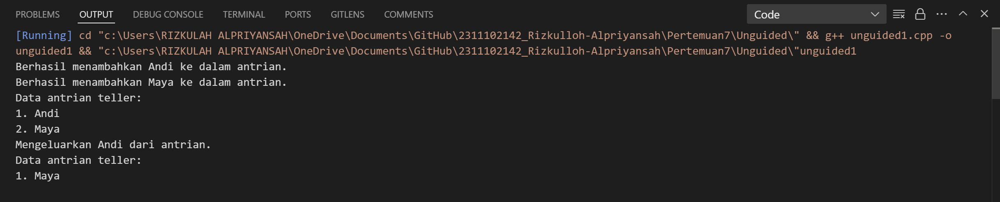
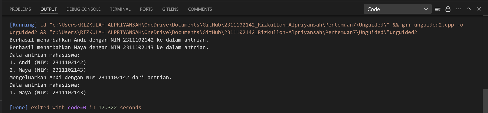

# <h1 align="center">Laporan Praktikum MODUL VIII QUEUE</h1>

<p align="center">Rizkulloh Alpriyansah</p>

### Queue

Queue adalah struktur data linear yang mengikuti prinsip First In First Out (FIFO), yang berarti elemen yang pertama dimasukkan ke dalam queue akan menjadi elemen yang pertama pula keluar. Queue mirip dengan antrian di kehidupan sehari-hari, seperti antrian pembayaran di kasir atau antrian kendaraan di jalan raya.

### Operasi Dasar Queue

1. **Enqueue**: Operasi untuk menambahkan elemen baru ke dalam queue pada posisi akhir.
2. **Dequeue**: Operasi untuk menghapus elemen pertama dari queue.
3. **Front**: Mengakses elemen pertama dari queue tanpa menghapusnya.
4. **IsEmpty**: Memeriksa apakah queue kosong atau tidak.
5. **IsFull**: Memeriksa apakah queue penuh atau tidak (pada implementasi yang menggunakan alokasi memori statis).

### Implementasi Queue

Queue dapat diimplementasikan menggunakan dua pendekatan utama: menggunakan array atau menggunakan linked list.

1. **Array-based Queue**: Pada implementasi ini, queue direpresentasikan menggunakan array dengan dua pointer, yaitu `front` dan `rear`. `Front` menunjukkan elemen pertama dalam queue, sedangkan `rear` menunjukkan elemen terakhir. Operasi enqueue dilakukan dengan menambahkan elemen baru di posisi `rear`, sedangkan operasi dequeue dilakukan dengan menghapus elemen pada posisi `front`.

2. **Linked List-based Queue**: Pada implementasi ini, queue direpresentasikan menggunakan linked list, di mana setiap elemen dalam queue direpresentasikan oleh node. Setiap node memiliki data dan pointer ke node berikutnya. Operasi enqueue dilakukan dengan menambahkan node baru di posisi akhir linked list (atau `back`), sedangkan operasi dequeue dilakukan dengan menghapus node pertama (atau `front`) dari linked list.

### Keuntungan dan Kekurangan Queue

- **Keuntungan**:

  - Memungkinkan penyimpanan dan pengambilan data secara efisien sesuai prinsip FIFO.
  - Cocok untuk masalah yang memerlukan penanganan antrian, seperti penjadwalan tugas atau penanganan pesan.

- **Kekurangan**:
  - Implementasi array-based queue memiliki batasan ukuran, sementara implementasi linked list membutuhkan alokasi memori tambahan.
  - Operasi dequeue pada array-based queue dapat menjadi lambat jika banyak elemen perlu dipindahkan setelah penghapusan.

### Contoh Penggunaan Queue

Queue sering digunakan dalam berbagai aplikasi, termasuk:

- Sistem antrian di tempat pelayanan seperti bank atau kasir supermarket.
- Penjadwalan tugas dalam sistem operasi.
- Penanganan pesan dalam komunikasi jaringan.
- Buffering data dalam pemrosesan sinyal digital.

Dengan prinsip FIFO-nya, queue merupakan struktur data yang penting dan umum digunakan dalam pemrograman komputer untuk menangani berbagai masalah yang melibatkan urutan dan penjadwalan.

## Dasar Teori

## Guided

### 1. [Guided I]

```C++
// Dibuat oleh Rizkulloh Alpriyansah dengan NIM 2311102142
#include <iostream>
using namespace std;
const int maksimalQueue = 5; // Maksimal antrian
int front = 0;               // Penanda antrian
int back = 0;                // Penanda
string queueTeller[5];       // Fungsi pengecekan
bool isFull()
{ // Pengecekan antrian penuh atau tidak
    if (back == maksimalQueue)
    {
        return true; // =1
    }
    else
    {
        return false;
    }
}
bool isEmpty()
{ // Antriannya kosong atau tidak
    if (back == 0)
    {
        return true;
    }
    else
    {
        return false;
    }
}
void enqueueAntrian(string data)
{ // Fungsi menambahkan antrian
    if (isFull())
    {
        cout << "Antrian penuh" << endl;
    }
    else
    {
        if (isEmpty())
        { // Kondisi ketika queue kosong
            queueTeller[0] = data;
            front++;
            back++;
        }
        else
        { // Antrianya ada isi
            queueTeller[back] = data;
            back++;
        }
    }
}
void dequeueAntrian()
{ // Fungsi mengurangi antrian
    if (isEmpty())
    {
        cout << "Antrian kosong" << endl;
    }
    else
    {
        for (int i = 0; i < back; i++)
        {
            queueTeller[i] = queueTeller[i + 1];
        }
        back--;
    }
}
int countQueue()
{ // Fungsi menghitung banyak antrian
    return back;
}
void clearQueue()
{ // Fungsi menghapus semua antrian
    if (isEmpty())
    {
        cout << "Antrian kosong" << endl;
    }
    else
    {
        for (int i = 0; i < back; i++)
        {
            queueTeller[i] = "";
        }
        back = 0;
        front = 0;
    }
}
void viewQueue()
{ // Fungsi melihat antrian
    cout << "Data antrian teller:" << endl;
    for (int i = 0; i < maksimalQueue; i++)
    {
        if (queueTeller[i] != "")
        {
            cout << i + 1 << ". " << queueTeller[i] << endl;
        }
        else
        {
            cout << i + 1 << ". (kosong)" << endl;
        }
    }
}
int main()
{
    enqueueAntrian("Andi");
    enqueueAntrian("Maya");
    viewQueue();
    cout << "Jumlah antrian = " << countQueue() << endl;
    dequeueAntrian();
    viewQueue();
    cout << "Jumlah antrian = " << countQueue() << endl;
    clearQueue();
    viewQueue();
    cout << "Jumlah antrian = " << countQueue() << endl;
    return 0;
}
```

### ->Penjelasan

Kode ini mengimplementasikan antrian (queue) menggunakan array dengan ukuran maksimal lima elemen. Antrian diwakili oleh array `queueTeller` dengan penanda posisi depan (`front`) dan belakang (`back`). Fungsi `isFull()` mengecek apakah antrian penuh, sedangkan `isEmpty()` mengecek apakah antrian kosong. Fungsi `enqueueAntrian()` menambahkan elemen ke antrian jika tidak penuh, dan `dequeueAntrian()` mengeluarkan elemen terdepan serta menggeser elemen lain ke depan jika antrian tidak kosong. Fungsi `countQueue()` mengembalikan jumlah elemen dalam antrian, `clearQueue()` mengosongkan antrian, dan `viewQueue()` menampilkan isi antrian. Dalam fungsi `main()`, beberapa elemen ditambahkan ke antrian, ditampilkan, satu elemen dikeluarkan, kemudian antrian ditampilkan lagi, dan akhirnya antrian dikosongkan serta ditampilkan hasilnya.

## Unguided

### 1. [Ubahlah penerapan konsep queue pada bagian guided dari array menjadi linked list]

```C++
#include <iostream>
using namespace std;

struct Node_142
{
    string data_142;
    Node_142 *next_142;
};

class Queue_142
{
private:
    Node_142 *front_142;
    Node_142 *back_142;

public:
    Queue_142() : front_142(nullptr), back_142(nullptr) {}

    bool isEmpty_142()
    {
        return front_142 == nullptr;
    }

    void enqueue_142(const string &data_142)
    {
        Node_142 *newNode_142 = new Node_142;
        newNode_142->data_142 = data_142;
        newNode_142->next_142 = nullptr;

        if (isEmpty_142())
        {
            front_142 = newNode_142;
            back_142 = newNode_142;
        }
        else
        {
            back_142->next_142 = newNode_142;
            back_142 = newNode_142;
        }
        cout << "Berhasil menambahkan " << data_142 << " ke dalam antrian." << endl;
    }

    void dequeue_142()
    {
        if (isEmpty_142())
        {
            cout << "Antrian kosong" << endl;
            return;
        }
        Node_142 *temp_142 = front_142;
        cout << "Mengeluarkan " << front_142->data_142 << " dari antrian." << endl;
        front_142 = front_142->next_142;
        delete temp_142;
    }

    void viewQueue_142()
    {
        if (isEmpty_142())
        {
            cout << "Antrian kosong" << endl;
            return;
        }
        cout << "Data antrian teller:" << endl;
        Node_142 *current_142 = front_142;
        int count_142 = 1;
        while (current_142 != nullptr)
        {
            cout << count_142 << ". " << current_142->data_142 << endl;
            current_142 = current_142->next_142;
            count_142++;
        }
    }
};

int main()
{
    Queue_142 queue_142;
    queue_142.enqueue_142("Andi");
    queue_142.enqueue_142("Maya");
    queue_142.viewQueue_142();
    queue_142.dequeue_142();
    queue_142.viewQueue_142();
    return 0;
}


```

#### Output :



## ->Penjelasan Program:

Kode ini mendemonstrasikan implementasi antrian (queue) menggunakan linked list dalam bahasa C++. Struktur `Node_142` merepresentasikan setiap node dalam linked list, dengan atribut `data_142` untuk menyimpan data dan `next_142` sebagai pointer ke node berikutnya. Kelas `Queue_142` mengelola antrian dengan pointer `front_142` yang menunjuk ke elemen pertama dan `back_142` yang menunjuk ke elemen terakhir. Konstruktor `Queue_142` menginisialisasi antrian sebagai kosong dengan `front_142` dan `back_142` diatur ke `nullptr`. Fungsi `isEmpty_142()` mengecek apakah antrian kosong. Fungsi `enqueue_142()` menambahkan elemen baru ke antrian; jika antrian kosong, elemen baru menjadi `front_142` dan `back_142`, jika tidak, elemen baru ditambahkan di belakang dan `back_142` diperbarui. Fungsi `dequeue_142()` mengeluarkan elemen dari depan antrian; jika antrian kosong, menampilkan pesan kesalahan, jika tidak, elemen depan dihapus dan `front_142` diperbarui ke elemen berikutnya. Fungsi `viewQueue_142()` menampilkan semua elemen dalam antrian; jika antrian kosong, menampilkan pesan "Antrian kosong", jika tidak, mencetak data dari setiap node mulai dari depan hingga belakang. Dalam fungsi `main()`, beberapa operasi dilakukan untuk menunjukkan penggunaan antrian: menambahkan elemen ke antrian (`enqueue_142`), menampilkan antrian (`viewQueue_142`), mengeluarkan elemen dari antrian (`dequeue_142`), dan kembali menampilkan antrian untuk menunjukkan perubahan setelah penghapusan elemen.

### Kesimpulan

Kode ini mendemonstrasikan bagaimana mengelola antrian menggunakan linked list. Linked list memungkinkan antrian memiliki ukuran dinamis, tidak dibatasi oleh ukuran array tetap. Implementasi ini mencakup fungsi dasar antrian seperti menambah (enqueue), mengeluarkan (dequeue), dan menampilkan isi antrian (viewQueue). Kode juga mencakup pengecekan apakah antrian kosong untuk menghindari kesalahan saat mencoba mengeluarkan elemen dari antrian kosong. Dengan demikian, kode ini menunjukkan cara yang efektif dan fleksibel untuk mengelola antrian dalam program C++.

### 2. [Dari nomor 1 buatlah konsep antri dengan atribut Nama mahasiswa dan NIM Mahasiswa]

```C++
#include <iostream>
using namespace std;

struct Mahasiswa_142
{
    string nama_142;
    string nim_142;
};

struct Node_142
{
    Mahasiswa_142 data_142;
    Node_142 *next_142;
};

class Queue_142
{
private:
    Node_142 *front_142;
    Node_142 *back_142;

public:
    Queue_142() : front_142(nullptr), back_142(nullptr) {}

    bool isEmpty_142()
    {
        return front_142 == nullptr;
    }

    void enqueue_142(const Mahasiswa_142 &mhs_142)
    {
        Node_142 *newNode_142 = new Node_142;
        newNode_142->data_142 = mhs_142;
        newNode_142->next_142 = nullptr;

        if (isEmpty_142())
        {
            front_142 = newNode_142;
            back_142 = newNode_142;
        }
        else
        {
            back_142->next_142 = newNode_142;
            back_142 = newNode_142;
        }
        cout << "Berhasil menambahkan " << mhs_142.nama_142 << " dengan NIM " << mhs_142.nim_142 << " ke dalam antrian." << endl;
    }

    void dequeue_142()
    {
        if (isEmpty_142())
        {
            cout << "Antrian kosong" << endl;
            return;
        }
        Node_142 *temp_142 = front_142;
        cout << "Mengeluarkan " << front_142->data_142.nama_142 << " dengan NIM " << front_142->data_142.nim_142 << " dari antrian." << endl;
        front_142 = front_142->next_142;
        delete temp_142;
    }

    void viewQueue_142()
    {
        if (isEmpty_142())
        {
            cout << "Antrian kosong" << endl;
            return;
        }
        cout << "Data antrian mahasiswa:" << endl;
        Node_142 *current_142 = front_142;
        int count_142 = 1;
        while (current_142 != nullptr)
        {
            cout << count_142 << ". " << current_142->data_142.nama_142 << " (NIM: " << current_142->data_142.nim_142 << ")" << endl;
            current_142 = current_142->next_142;
            count_142++;
        }
    }
};

int main()
{
    Queue_142 queue_142;
    Mahasiswa_142 mhs1_142 = {"Andi", "2311102142"};
    Mahasiswa_142 mhs2_142 = {"Maya", "2311102143"};
    queue_142.enqueue_142(mhs1_142);
    queue_142.enqueue_142(mhs2_142);
    queue_142.viewQueue_142();
    queue_142.dequeue_142();
    queue_142.viewQueue_142();
    return 0;
}
```

#### Output :



## ->Penjelasan Program:

Kode di atas mengimplementasikan struktur data antrian (queue) menggunakan linked list untuk menyimpan data mahasiswa dalam bahasa C++. Struktur `Mahasiswa_142` menyimpan informasi mahasiswa berupa nama dan NIM. Setiap elemen dalam antrian direpresentasikan oleh `Node_142` yang berisi data mahasiswa (`Mahasiswa_142`) dan pointer ke elemen berikutnya (`next_142`). Kelas `Queue_142` mengelola operasi antrian dengan dua pointer: `front_142` menunjuk ke elemen pertama dan `back_142` menunjuk ke elemen terakhir. Kelas ini memiliki konstruktor yang menginisialisasi antrian kosong. Fungsi `isEmpty_142` memeriksa apakah antrian kosong, `enqueue_142` menambahkan mahasiswa baru ke akhir antrian, dan `dequeue_142` mengeluarkan mahasiswa dari awal antrian. Fungsi `viewQueue_142` menampilkan semua mahasiswa dalam antrian, mulai dari depan hingga belakang. Dalam fungsi `main`, dua mahasiswa (Andi dan Maya) ditambahkan ke antrian menggunakan `enqueue_142`, antrian kemudian ditampilkan dengan `viewQueue_142`, salah satu mahasiswa dikeluarkan dari antrian menggunakan `dequeue_142`, dan antrian ditampilkan kembali untuk menunjukkan perubahan.

## ->Kesimpulan

Kesimpulan dari kode di atas adalah bahwa antrian (queue) dapat diimplementasikan dengan menggunakan struktur linked list untuk menyimpan data secara dinamis, memungkinkan penambahan dan pengeluaran elemen dari antrian dengan efisien. Dalam contoh ini, data yang disimpan adalah informasi mahasiswa yang terdiri dari nama dan NIM. Metode yang diimplementasikan dalam kelas `Queue_142` termasuk pengecekan apakah antrian kosong (`isEmpty_142`), penambahan elemen ke akhir antrian (`enqueue_142`), pengeluaran elemen dari awal antrian (`dequeue_142`), dan penampilan isi antrian (`viewQueue_142`). Implementasi ini menunjukkan fleksibilitas dan efisiensi penggunaan linked list untuk mengelola antrian dalam situasi di mana ukuran data tidak diketahui atau bervariasi, memastikan bahwa antrian dapat berkembang sesuai kebutuhan tanpa batasan ukuran statis.

## Referensi

[1] Putri, Meidyan P., et al. ALGORITMA DAN STRUKTUR DATA. Edited by Putri, Meidyan P. CV WIDINA MEDIA UTAMA, 2022.

[2] Putra, Muhammad Taufik D., et al. BELAJAR DASAR PEMROGRAMAN DENGAN C++. Edited by Damayanti, Evi, CV WIDINA MEDIA UTAMA, 2022.

[3] Karumanchi, N. (2016). Data Structures and algorithms made easy: Concepts, problems, Interview Questions. CareerMonk Publications
