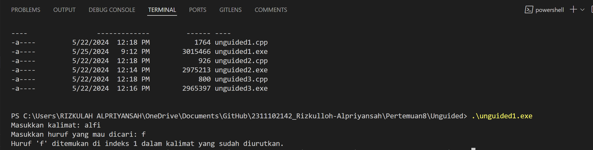
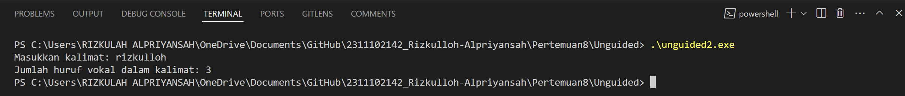
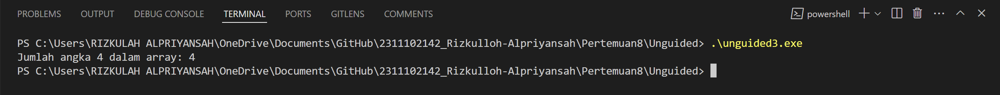

# <h1 align="center">Laporan Praktikum MODUL VIII ALGORITMA SEARCHING

</h1>

<p align="center">Rizkulloh Alpriyansah</p>

## Dasar Teori

Algoritma pencarian, dalam konteks komputer sains, merujuk pada metode untuk menemukan suatu item tertentu dalam kumpulan data yang diberikan. Ada beberapa algoritma pencarian yang berbeda, masing-masing dengan karakteristik, kelebihan, dan kelemahan tertentu. Di antara algoritma pencarian yang paling umum adalah pencarian sekuensial (linear), pencarian biner, dan pencarian hash. Berikut adalah dasar teori dan detail tentang beberapa algoritma pencarian:

1. **Pencarian Sekuensial (Linear)**:

   - Pencarian sekuensial adalah metode pencarian yang paling sederhana dan intuitif.
   - Algoritma ini bekerja dengan cara memeriksa setiap elemen satu per satu dari awal hingga akhir kumpulan data sampai item yang dicari ditemukan atau sampai seluruh kumpulan data telah diperiksa.
   - Kelebihan dari pencarian sekuensial adalah sederhana dan mudah diimplementasikan. Namun, pada kumpulan data yang besar, algoritma ini bisa menjadi lambat karena memerlukan waktu yang proporsional dengan jumlah elemen dalam kumpulan data.

2. **Pencarian Biner**:

   - Pencarian biner bekerja dengan asumsi bahwa kumpulan data sudah dalam keadaan terurut.
   - Algoritma ini membagi kumpulan data menjadi dua bagian dan memeriksa elemen tengah. Jika elemen tengah sama dengan item yang dicari, pencarian selesai. Jika tidak, algoritma memilih bagian kumpulan data yang mungkin berisi item yang dicari dan melanjutkan pencarian di bagian tersebut.
   - Kelebihan utama dari pencarian biner adalah efisiensinya. Pencarian biner memiliki kompleksitas waktu O(log n), yang artinya waktu yang diperlukan untuk mencari item tidak akan tumbuh secara linier dengan penambahan elemen dalam kumpulan data. Namun, satu kelemahannya adalah bahwa kumpulan data harus terurut sebelum pencarian dapat dilakukan.

3. **Pencarian Hash**:
   - Pencarian hash menggunakan struktur data hash table, di mana item disimpan dan diakses menggunakan fungsi hash.
   - Algoritma ini bekerja dengan cara mengonversi kunci pencarian menjadi indeks menggunakan fungsi hash. Selanjutnya, algoritma mengakses lokasi yang sesuai dalam hash table untuk mencari item yang dicari.
   - Pencarian hash memiliki kompleksitas waktu rata-rata yang sangat cepat (O(1)), tetapi keefektifannya tergantung pada fungsi hash yang baik dan pengelolaan tabrakan yang efisien.

## Guided

### 1. [Guided I]

```C++
#include <iostream>
using namespace std;
int main()
{
    int n = 10;
    int data[n] = {9, 4, 1, 7, 5, 12, 4, 13, 4, 10};
    int cari = 10;
    bool ketemu = false;
    int i;
    // Algoritma Sequential Search
    for (i = 0; i < n; i++)
    {
        if (data[i] == cari)
        {
            ketemu = true;
            break;
        }
    }
    cout << "\tProgram Sequential Search Sederhana\n"
         << endl;
    cout << "data: {9, 4, 1, 7, 5, 12, 4, 13, 4, 10}" << endl;
    if (ketemu)
    {
        cout << "\nAngka " << cari << " ditemukan pada indeks ke-"
             << i << endl;
    }
    else
    {
        cout << cari << " tidak dapat ditemukan pada data." << endl;
    }
    return 0;
}

```

### ->Penjelasan

Kode ini merupakan program sederhana yang menggunakan algoritma pencarian sekuensial untuk mencari sebuah nilai dalam array. Program ini pertama-tama menginisialisasi sebuah array dengan beberapa nilai, kemudian mencari nilai tertentu di dalamnya dengan menggunakan algoritma pencarian sekuensial. Jika nilai tersebut ditemukan, program akan mencetak pesan yang menyatakan indeks dimana nilai tersebut ditemukan dalam array. Jika tidak, program akan mencetak pesan yang menyatakan bahwa nilai tersebut tidak ditemukan dalam array.

### 2. [Guided 2]

```C++
#include <iostream>
#include <conio.h>
#include <iomanip>
using namespace std;
int dataArray[7] = {1, 8, 2, 5, 4, 9, 7};
int cari;
void selection_sort()
{
    int temp, min, i, j;
    for (i = 0; i < 7; i++)
    {
        min = i;
        for (j = i + 1; j < 7; j++)
        {
            if (dataArray[j] < dataArray[min])
            {
                min = j;
            }
        }
        temp = dataArray[i];
        dataArray[i] = dataArray[min];
        dataArray[min] = temp;
    }
}
void binarysearch()
{
    int awal, akhir, tengah;
    bool b_flag = false;
    awal = 0;
    akhir = 6; // Corrected to 6 to match array bounds
    while (!b_flag && awal <= akhir)
    {
        tengah = (awal + akhir) / 2;
        if (dataArray[tengah] == cari)
        {
            b_flag = true;
        }
        else if (dataArray[tengah] < cari)
        {
            awal = tengah + 1;
        }
        else
        {
            akhir = tengah - 1;
        }
    }
    if (b_flag)
    {
        cout << "\nData ditemukan pada index ke- " << tengah << endl;
    }
    else
    {
        cout << "\nData tidak ditemukan\n";
    }
}
int main()
{
    cout << "\tBINARY SEARCH" << endl;
    cout << "\nData: ";
    // Tampilkan data awal
    for (int x = 0; x < 7; x++)
    {
        cout << setw(3) << dataArray[x];
    }
    cout << endl;
    cout << "\nMasukkan data yang ingin Anda cari: ";
    cin >> cari;
    cout << "\nData diurutkan: ";
    // Urutkan data dengan selection sort
    selection_sort();
    // Tampilkan data setelah diurutkan
    for (int x = 0; x < 7; x++)
    {
        cout << setw(3) << dataArray[x];
    }
    cout << endl;
    binarysearch();
    _getche();
    return 0;
}
```

### ->Penjelasan

Kode ini adalah implementasi dari algoritma binary search dalam bahasa C++. Program ini pertama-tama melakukan pengurutan array menggunakan algoritma selection sort untuk memastikan bahwa array dalam keadaan terurut sebelum dilakukan pencarian biner. Setelah array diurutkan, pengguna diminta untuk memasukkan nilai yang ingin dicari. Kemudian, program akan mencari nilai tersebut menggunakan algoritma binary search. Jika nilai ditemukan dalam array, program akan mencetak indeks dimana nilai tersebut ditemukan. Jika tidak, program akan mencetak pesan bahwa nilai tidak ditemukan. Program ini kemudian menunggu input dari pengguna sebelum menutup jendela konsol.

### 1. [Buatlah sebuah program untuk mencari sebuah huruf pada sebuah kalimat yang sudah di input dengan menggunakan Binary Search!]

```C++
// Dibuat oleh Rizkulloh Alpriyansah dengan NIM 2311102142
#include <iostream>
#include <algorithm>
#include <string>

using namespace std;

// Fungsi buat binary search
int binarySearch_142(const string &sorted_str_142, char target_142)
{
    int left_142 = 0;
    int right_142 = sorted_str_142.size() - 1;

    while (left_142 <= right_142)
    {
        int mid_142 = left_142 + (right_142 - left_142) / 2;

        if (sorted_str_142[mid_142] == target_142)
        {
            return mid_142;
        }
        else if (sorted_str_142[mid_142] < target_142)
        {
            left_142 = mid_142 + 1;
        }
        else
        {
            right_142 = mid_142 - 1;
        }
    }
    return -1;
}

int main()
{
    string sentence_142;
    char target_142;

    // Input kalimat
    cout << "Masukkan kalimat: ";
    getline(cin, sentence_142);

    // Input huruf yang mau dicari
    cout << "Masukkan huruf yang mau dicari: ";
    cin >> target_142;

    // Hilangin spasi dari kalimat
    sentence_142.erase(remove(sentence_142.begin(), sentence_142.end(), ' '), sentence_142.end());

    // Ubah kalimat jadi huruf kecil semua
    transform(sentence_142.begin(), sentence_142.end(), sentence_142.begin(), ::tolower);

    // Urutkan kalimat
    sort(sentence_142.begin(), sentence_142.end());

    // Lakukan binary search
    int result_142 = binarySearch_142(sentence_142, target_142);

    if (result_142 != -1)
    {
        cout << "Huruf '" << target_142 << "' ditemukan di indeks " << result_142 << " dalam kalimat yang sudah diurutkan.\n";
    }
    else
    {
        cout << "Huruf '" << target_142 << "' tidak ditemukan dalam kalimat.\n";
    }

    return 0;
}
```

#### Output :



## ->Penjelasan Program:

Kode ini adalah implementasi dari algoritma pencarian biner (binary search) untuk mencari keberadaan sebuah karakter dalam sebuah kalimat yang dimasukkan pengguna. Berikut adalah penjelasan singkat tentang bagaimana kode ini berfungsi:

1. **Fungsi Binary Search (binarySearch_142)**:

   - Fungsi ini menerima dua parameter: sebuah string yang telah diurutkan (sorted_str_142) dan karakter target yang ingin dicari (target_142).
   - Pertama, fungsi ini menetapkan dua indeks awal, yaitu left_142 dan right_142, yang mengacu pada indeks pertama dan terakhir dalam string.
   - Selama left_142 kurang dari atau sama dengan right_142, fungsi ini menghitung indeks tengah (mid_142) dan memeriksa apakah karakter target berada di tengah string.
   - Jika karakter target ditemukan, fungsi mengembalikan indeks tempat karakter tersebut ditemukan.
   - Jika karakter target kurang dari karakter di tengah string, fungsi memperbarui right_142 untuk mengecualikan setengah kanan dari string.
   - Jika karakter target lebih besar dari karakter di tengah string, fungsi memperbarui left_142 untuk mengecualikan setengah kiri dari string.
   - Jika karakter target tidak ditemukan setelah iterasi selesai, fungsi mengembalikan -1.

2. **Fungsi Utama (main)**:
   - Di dalam fungsi main, pengguna diminta untuk memasukkan sebuah kalimat dan sebuah karakter yang ingin dicari.
   - Kalimat tersebut kemudian dihapus spasi, diubah menjadi huruf kecil semua, dan diurutkan menggunakan fungsi transform dan sort.
   - Setelah itu, fungsi binary search dipanggil untuk mencari keberadaan karakter target dalam kalimat yang telah diurutkan.
   - Hasil pencarian kemudian dicetak ke layar, yang memberi tahu pengguna apakah karakter target ditemukan dan diindeks di mana dalam kalimat.

### Kesimpulan

Dari kode yang diberikan, dapat disimpulkan bahwa:

1. Algoritma pencarian biner (binary search) digunakan untuk mencari keberadaan sebuah karakter dalam sebuah kalimat yang telah diurutkan.
2. Pengguna diminta untuk memasukkan kalimat dan karakter yang ingin dicari.
3. Kalimat tersebut dihilangkan spasi, diubah menjadi huruf kecil semua, dan diurutkan.
4. Setelah itu, dilakukan pencarian biner untuk mencari keberadaan karakter target dalam kalimat yang telah diurutkan.
5. Hasil pencarian kemudian dicetak ke layar, memberikan informasi kepada pengguna apakah karakter target ditemukan dan diindeks di mana dalam kalimat.

Dengan demikian, kode ini menggabungkan penggunaan string, pengurutan, dan pencarian biner untuk mencari karakter dalam sebuah kalimat dengan cara yang efisien dan efektif.

### 2. [Buatlah sebuah program yang dapat menghitung banyaknya huruf vocal dalam sebuah kalimat!]

```C++
// Dibuat oleh Rizkulloh Alpriyansah dengan NIM 2311102142
#include <iostream>
#include <string>

using namespace std;

// Fungsi buat nyari huruf vokal
bool isVowel_142(char c_142)
{
    c_142 = tolower(c_142); // Biar gak case-sensitive
    return (c_142 == 'a' || c_142 == 'e' || c_142 == 'i' || c_142 == 'o' || c_142 == 'u');
}

int countVowels_142(const string &sentence_142)
{
    int vowelCount_142 = 0;

    for (char c_142 : sentence_142)
    {
        if (isVowel_142(c_142))
        {
            vowelCount_142++;
        }
    }

    return vowelCount_142;
}

int main()
{
    string sentence_142;

    // Input kalimat
    cout << "Masukkan kalimat: ";
    getline(cin, sentence_142);

    // Hitung jumlah huruf vokal
    int vowelCount_142 = countVowels_142(sentence_142);

    cout << "Jumlah huruf vokal dalam kalimat: " << vowelCount_142 << endl;

    return 0;
}

```

#### Output :



## ->Penjelasan Program:

Program yang dibuat oleh Rizkulloh Alpriyansah dengan NIM 2311102142 bertujuan untuk menghitung jumlah huruf vokal dalam sebuah kalimat yang dimasukkan pengguna. Dengan menggunakan dua fungsi, yaitu isVowel_142 untuk menentukan apakah sebuah karakter merupakan huruf vokal, dan countVowels_142 untuk menghitung jumlah huruf vokal dalam sebuah kalimat, program ini memberikan solusi yang sederhana namun efektif bagi pengguna. Setelah pengguna memasukkan kalimat, program menghitung jumlah huruf vokal dalam kalimat tersebut dan mencetak hasilnya ke layar, memberikan informasi yang berguna kepada pengguna tentang struktur kalimat yang dimasukkan.

## ->Kesimpulan

Dalam program yang dibuat oleh Rizkulloh Alpriyansah dengan NIM 2311102142, dapat disimpulkan bahwa:

1. Program ini bertujuan untuk menghitung jumlah huruf vokal dalam sebuah kalimat yang dimasukkan oleh pengguna.
2. Untuk menyelesaikan tugas ini, program menggunakan dua fungsi utama:
   - Fungsi isVowel_142 untuk menentukan apakah sebuah karakter merupakan huruf vokal.
   - Fungsi countVowels_142 untuk menghitung jumlah huruf vokal dalam sebuah kalimat.
3. Pengguna diminta untuk memasukkan sebuah kalimat, dan setelah itu program menghitung jumlah huruf vokal dalam kalimat tersebut.
4. Program kemudian mencetak jumlah huruf vokal tersebut ke layar untuk memberikan informasi kepada pengguna.
5. Dengan menggunakan pendekatan ini, program memberikan solusi yang sederhana namun efektif untuk menghitung jumlah huruf vokal dalam sebuah kalimat.

Jadi, keseluruhan program ini memberikan fungsi yang berguna bagi pengguna untuk menghitung jumlah huruf vokal dalam kalimat yang dimasukkan, yang dapat digunakan dalam berbagai konteks pemrograman.

### 3. [ Diketahui data = 9, 4, 1, 4, 7, 10, 5, 4, 12, 4. Hitunglah berapa banyak angka 4 dengan menggunakan algoritma Sequential Search!]

```C++
// Dibuat oleh Rizkulloh Alpriyansah dengan NIM 2311102142
#include <iostream>

using namespace std;

// Fungsi buat menghitung jumlah angka 4 menggunakan Sequential Search
int countNumber_142(const int data_142[], int size_142, int target_142)
{
    int count_142 = 0;
    for (int i_142 = 0; i_142 < size_142; ++i_142)
    {
        if (data_142[i_142] == target_142)
        {
            count_142++;
        }
    }
    return count_142;
}

int main()
{
    int data_142[] = {9, 4, 1, 4, 7, 10, 5, 4, 12, 4};
    int size_142 = sizeof(data_142) / sizeof(data_142[0]);
    int target_142 = 4;

    int count_142 = countNumber_142(data_142, size_142, target_142);

    cout << "Jumlah angka " << target_142 << " dalam array: " << count_142 << endl;

    return 0;
}

```

#### Output :



## ->Penjelasan Program:

Program ini, yang dibuat oleh Rizkulloh Alpriyansah dengan NIM 2311102142, bertujuan untuk menghitung jumlah kemunculan angka 4 dalam sebuah array menggunakan algoritma Sequential Search. Dalam program ini, sebuah array diberikan dengan beberapa nilai, dan kemudian program mengiterasi melalui setiap elemen dalam array tersebut. Pada setiap iterasi, program memeriksa apakah nilai elemen tersebut sama dengan angka target yang ditentukan. Jika iya, maka variabel hitung bertambah satu. Setelah selesai iterasi, program mencetak jumlah kemunculan angka 4 ke layar. Dengan demikian, program ini memberikan informasi kepada pengguna tentang berapa kali angka 4 muncul dalam array yang diberikan, menggunakan pendekatan pencarian sekuensial.

## ->Kesimpulan

Program ini, dibuat oleh Rizkulloh Alpriyansah dengan NIM 2311102142, menghitung jumlah kemunculan angka 4 dalam sebuah array menggunakan Sequential Search. Dengan metode ini, program secara efektif mengiterasi setiap elemen dalam array, memeriksa kecocokan dengan angka target, dan menghitung jumlah kemunculannya. Hasilnya kemudian dicetak untuk memberikan informasi kepada pengguna tentang struktur array yang diberikan.

## Referensi

[1] Putri, Meidyan P., et al. ALGORITMA DAN STRUKTUR DATA. Edited by Putri, Meidyan P. CV WIDINA MEDIA UTAMA, 2022.

[2] Putra, Muhammad Taufik D., et al. BELAJAR DASAR PEMROGRAMAN DENGAN C++. Edited by Damayanti, Evi, CV WIDINA MEDIA UTAMA, 2022.

[3] Karumanchi, N. (2016). Data Structures and algorithms made easy: Concepts, problems, Interview Questions. CareerMonk Publications
