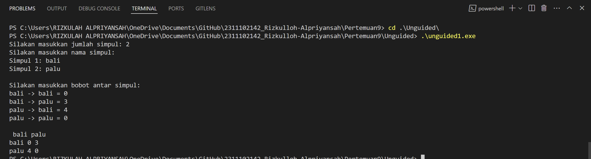

# <h1 align="center">Laporan Praktikum MODUL IX GRAPH DAN TREE</h1>

<p align="center">Rizkulloh Alpriyansah</p>

## Dasar Teori

Tentu, mari kita bahas secara lebih detail tentang Graph dan Tree dalam konteks pemrograman C++:

**Graph**:
Graph adalah struktur data yang terdiri dari kumpulan node (simpul) yang terhubung oleh edge (sisi). Setiap edge dapat memiliki arah (directed) atau tidak (undirected). Graph digunakan untuk merepresentasikan berbagai hubungan antara objek, seperti jaringan komputer, jaringan sosial, jaringan transportasi, dan banyak lagi. Terdapat beberapa konsep dasar yang perlu dipahami tentang graph:

- **Node (Vertex)**: Representasi dari objek atau entitas dalam graph.
- **Edge (Edge)**: Koneksi antara dua node yang dapat memiliki arah (directed) atau tidak (undirected).
- **Directed Graph (Digraf)**: Graph di mana setiap edge memiliki arah yang ditentukan.
- **Undirected Graph (Graf tak Berarah)**: Graph di mana setiap edge tidak memiliki arah.
- **Weighted Graph (Graph Bertimbang)**: Graph di mana setiap edge memiliki bobot atau nilai tertentu yang terkait.
- **Cyclic Graph (Graf Ber-siklus)**: Graph yang memiliki setidaknya satu jalur yang membentuk siklus (loop).
- **Acyclic Graph (Graf Tanpa Siklus)**: Graph yang tidak memiliki siklus.
  Graph dapat diimplementasikan menggunakan beberapa struktur data, termasuk:
- **Adjacency Matrix**: Matriks dua dimensi yang merepresentasikan hubungan antara setiap pasangan node dalam graph.
- **Adjacency List**: Representasi graph di mana setiap node disimpan bersama dengan daftar node yang terhubung langsung dengannya.
- **Incidence Matrix**: Matriks dua dimensi yang merepresentasikan hubungan antara node dan edge dalam graph.

**Tree**:
Tree adalah jenis khusus dari graph yang tidak memiliki siklus, yang berarti tidak ada jalur yang membentuk loop dari satu node kembali ke node itu sendiri. Tree memiliki sebuah node yang disebut sebagai root, yang merupakan simpul teratas dalam struktur. Setiap node dalam tree memiliki anak (child) yang terhubung ke bawahnya, dan setiap node kecuali root memiliki tepat satu node yang disebut sebagai parent (induk). Beberapa konsep penting dalam tree adalah:

- **Root**: Node teratas dalam tree.
- **Child**: Node yang terhubung langsung ke bawah node tertentu.
- **Parent**: Node yang terhubung langsung ke atas node tertentu.
- **Leaf**: Node yang tidak memiliki anak.
- **Level**: Jarak dari root ke suatu node dalam tree.
- **Height**: Jarak terjauh dari root ke daun terjauh dalam tree.
  Tree memiliki beberapa jenis yang umum digunakan, termasuk:
- **Binary Tree**: Tree di mana setiap node memiliki paling banyak dua anak.
- **Binary Search Tree (BST)**: Jenis binary tree di mana setiap node memiliki nilai yang lebih besar dari semua node di bawahnya pada subtree kiri, dan nilai yang lebih kecil dari semua node di bawahnya pada subtree kanan.
- **AVL Tree**: Jenis binary search tree yang diatur sedemikian rupa sehingga setiap node memiliki keseimbangan yang baik, yaitu perbedaan tinggi subtree kiri dan kanan setiap node adalah maksimal satu.
- **Red-Black Tree**: Struktur data yang mirip dengan AVL tree, namun dengan aturan penyeimbangan yang sedikit lebih longgar, yang menghasilkan kompleksitas operasional yang lebih rendah dalam beberapa kasus.

Dalam pemrograman C++, Anda dapat menggunakan berbagai pendekatan dan struktur data yang tersedia dalam library standar dan pustaka pihak ketiga untuk membuat, memanipulasi, dan menganalisis graph dan tree. Dengan pemahaman yang kuat tentang konsep dasar dan implementasi dari graph dan tree, Anda dapat membangun solusi yang efisien untuk berbagai masalah yang melibatkan struktur data ini dalam pemrograman C++.

## Guided

### 1. [Guided I]

```C++
#include <iostream>
#include <iomanip>

using namespace std;

// Nama-nama simpul
string simpul[7] = {
    "Ciamis", "Bandung", "Bekasi", "Tasikmalaya",
    "Cianjur", "Purwokerto", "Yogyakarta"};

// Matriks busur
int busur[7][7] = {
    {0, 7, 8, 0, 0, 0, 0},
    {0, 0, 5, 0, 0, 15, 0},
    {0, 6, 0, 0, 5, 0, 0},
    {0, 5, 0, 0, 2, 4, 0},
    {23, 0, 0, 10, 0, 0, 8},
    {0, 0, 0, 0, 7, 0, 3},
    {0, 0, 0, 0, 9, 4, 0}};

// Fungsi buat nampilin graph
void tampilGraph()
{
    for (int baris = 0; baris < 7; baris++)
    {
        cout << " " << setiosflags(ios::left) << setw(15) << simpul[baris] << " : ";
        for (int kolom = 0; kolom < 7; kolom++)
        {
            if (busur[baris][kolom] != 0)
            {
                cout << simpul[kolom] << "(" << busur[baris][kolom] << ") ";
            }
        }
        cout << endl;
    }
}

int main()
{
    tampilGraph();
    return 0;
}
```

### ->Penjelasan

Program ini adalah implementasi sederhana dari representasi grafik menggunakan matriks adjacency untuk beberapa kota di Indonesia. Matriks adjacency merepresentasikan hubungan antara simpul (kota dalam konteks ini) dengan menggunakan nilai-nilai yang menunjukkan keberadaan atau tidaknya busur (rute) antara kota-kota tersebut. Setiap baris dalam matriks mewakili simpul asal, dan setiap kolom mewakili simpul tujuan. Nilai non-nol dalam matriks menunjukkan adanya busur yang menghubungkan kedua simpul, dengan nilai tersebut mewakili bobot atau jarak antara kota-kota tersebut. Fungsi `tampilGraph()` digunakan untuk mencetak representasi grafik ke layar, dengan menampilkan daftar kota dan rute yang terhubung di antara mereka beserta bobotnya. Program ini memberikan pemahaman dasar tentang bagaimana grafik direpresentasikan dalam pemrograman C++ menggunakan matriks adjacency.

### 2. [Guided II]

```C++
#include <iostream>
#include <iomanip>
using namespace std;

struct Pohon
{
    char data;
    Pohon *left, *right, *parent;
};

Pohon *root, *baru;

void init()
{
    root = NULL;
}

bool isEmpty()
{
    return root == NULL;
}

void buatNode(char data)
{
    if (isEmpty())
    {
        root = new Pohon();
        root->data = data;
        root->left = NULL;
        root->right = NULL;
        root->parent = NULL;
        cout << "\n Node " << data << " berhasil dibuat sebagai root." << endl;
    }
    else
    {
        cout << "\n Tree sudah ada!" << endl;
    }
}

Pohon *insertLeft(char data, Pohon *node)
{
    if (isEmpty())
    {
        cout << "\n Buat tree terlebih dahulu!" << endl;
        return NULL;
    }
    else
    {
        if (node->left != NULL)
        {
            cout << "\n Node " << node->data << " sudah ada child kiri!" << endl;
            return NULL;
        }
        else
        {
            Pohon *baru = new Pohon();
            baru->data = data;
            baru->left = NULL;
            baru->right = NULL;
            baru->parent = node;
            node->left = baru;
            cout << "\n Node " << data << " berhasil ditambahkan ke child kiri " << baru->parent->data << endl;
            return baru;
        }
    }
}

Pohon *insertRight(char data, Pohon *node)
{
    if (isEmpty())
    {
        cout << "\n Buat tree terlebih dahulu!" << endl;
        return NULL;
    }
    else
    {
        if (node->right != NULL)
        {
            cout << "\n Node " << node->data << " sudah ada child kanan!" << endl;
            return NULL;
        }
        else
        {
            Pohon *baru = new Pohon();
            baru->data = data;
            baru->left = NULL;
            baru->right = NULL;
            baru->parent = node;
            node->right = baru;
            cout << "\n Node " << data << " berhasil ditambahkan ke child kanan " << baru->parent->data << endl;
            return baru;
        }
    }
}

void update(char data, Pohon *node)
{
    if (isEmpty())
    {
        cout << "\n Buat tree terlebih dahulu!" << endl;
    }
    else
    {
        if (!node)
        {
            cout << "\n Node yang ingin diganti tidak ada!!" << endl;
        }
        else
        {
            char temp = node->data;
            node->data = data;
            cout << "\n Node " << temp << " berhasil diubah menjadi " << data << endl;
        }
    }
}

void retrieve(Pohon *node)
{
    if (isEmpty())
    {
        cout << "\n Buat tree terlebih dahulu!" << endl;
    }
    else
    {
        if (!node)
        {
            cout << "\n Node yang ditunjuk tidak ada!" << endl;
        }
        else
        {
            cout << "\n Data node : " << node->data << endl;
        }
    }
}

void find(Pohon *node)
{
    if (isEmpty())
    {
        cout << "\n Buat tree terlebih dahulu!" << endl;
    }
    else
    {
        if (!node)
        {
            cout << "\n Node yang ditunjuk tidak ada!" << endl;
        }
        else
        {
            cout << "\n Data Node : " << node->data << endl;
            cout << " Root : " << root->data << endl;
            if (!node->parent)
                cout << " Parent : (tidak punya parent)" << endl;
            else
                cout << " Parent : " << node->parent->data << endl;
            if (node->parent != NULL && node->parent->left != node && node->parent->right == node)
                cout << " Sibling : " << node->parent->left->data << endl;
            else if (node->parent != NULL && node->parent->right != node && node->parent->left == node)
                cout << " Sibling : " << node->parent->right->data << endl;
            else
                cout << " Sibling : (tidak punya sibling)" << endl;
            if (!node->left)
                cout << " Child Kiri : (tidak punya Child kiri)" << endl;
            else
                cout << " Child Kiri : " << node->left->data << endl;
            if (!node->right)
                cout << " Child Kanan : (tidak punya Child kanan)" << endl;
            else
                cout << " Child Kanan : " << node->right->data << endl;
        }
    }
}

// Penelusuran (Traversal)
// preOrder
void preOrder(Pohon *node)
{
    if (isEmpty())
    {
        cout << "\n Buat tree terlebih dahulu!" << endl;
    }
    else
    {
        if (node != NULL)
        {
            cout << " " << node->data << ", ";
            preOrder(node->left);
            preOrder(node->right);
        }
    }
}

// inOrder
void inOrder(Pohon *node)
{
    if (isEmpty())
    {
        cout << "\n Buat tree terlebih dahulu!" << endl;
    }
    else
    {
        if (node != NULL)
        {
            inOrder(node->left);
            cout << " " << node->data << ", ";
            inOrder(node->right);
        }
    }
}

// postOrder
void postOrder(Pohon *node)
{
    if (isEmpty())
    {
        cout << "\n Buat tree terlebih dahulu!" << endl;
    }
    else
    {
        if (node != NULL)
        {
            postOrder(node->left);
            postOrder(node->right);
            cout << " " << node->data << ", ";
        }
    }
}

// Hapus Node Tree
void deleteTree(Pohon *node)
{
    if (isEmpty())
    {
        cout << "\n Buat tree terlebih dahulu!" << endl;
    }
    else
    {
        if (node != NULL)
        {
            if (node != root)
            {
                node->parent->left = NULL;
                node->parent->right = NULL;
            }
            deleteTree(node->left);
            deleteTree(node->right);
            if (node == root)
            {
                delete root;
                root = NULL;
            }
            else
            {
                delete node;
            }
        }
    }
}

// Hapus SubTree
void deleteSub(Pohon *node)
{
    if (isEmpty())
    {
        cout << "\n Buat tree terlebih dahulu!" << endl;
    }
    else
    {
        deleteTree(node->left);
        deleteTree(node->right);
        cout << "\n Node subtree " << node->data << " berhasil dihapus." << endl;
    }
}

// Hapus Tree
void clear()
{
    if (isEmpty())
    {
        cout << "\n Buat tree terlebih dahulu!!" << endl;
    }
    else
    {
        deleteTree(root);
        cout << "\n Pohon berhasil dihapus." << endl;
    }
}

// Cek Size Tree
int size(Pohon *node = root)
{
    if (isEmpty())
    {
        cout << "\n Buat tree terlebih dahulu!!" << endl;
        return 0;
    }
    else
    {
        if (!node)
        {
            return 0;
        }
        else
        {
            return 1 + size(node->left) + size(node->right);
        }
    }
}

// Cek Height Level Tree
int height(Pohon *node = root)
{
    if (isEmpty())
    {
        cout << "\n Buat tree terlebih dahulu!" << endl;
        return 0;
    }
    else
    {
        if (!node)
        {
            return 0;
        }
        else
        {
            int heightKiri = height(node->left);
            int heightKanan = height(node->right);
            if (heightKiri >= heightKanan)
            {
                return heightKiri + 1;
            }
            else
            {
                return heightKanan + 1;
            }
        }
    }
}

// Karakteristik Tree
void characteristic()
{
    cout << "\n Size Tree : " << size() << endl;
    cout << " Height Tree : " << height() << endl;
    cout << " Average Node of Tree : " << size() / height() << endl;
}

int main()
{
    init();
    buatNode('A');
    Pohon *nodeB = insertLeft('B', root);
    Pohon *nodeC = insertRight('C', root);
    Pohon *nodeD = insertLeft('D', nodeB);
    Pohon *nodeE = insertRight('E', nodeB);
    Pohon *nodeF = insertLeft('F', nodeC);
    Pohon *nodeG = insertRight('G', nodeC);

    cout << "\nPreOrder Traversal: ";
    preOrder(root);
    cout << "\n\nInOrder Traversal: ";
    inOrder(root);
    cout << "\n\nPostOrder Traversal: ";
    postOrder(root);
    cout << "\n";

    characteristic();

    return 0;
}
```

### ->Penjelasan

Program C++ ini mengimplementasikan pohon biner dengan berbagai fungsi untuk manipulasi dan penelusuran pohon. Fungsi-fungsi utama termasuk `init` untuk inisialisasi pohon, `buatNode` untuk membuat node root, `insertLeft` dan `insertRight` untuk menambahkan node anak kiri dan kanan, serta `update`, `retrieve`, dan `find` untuk memodifikasi dan mencari node. Selain itu, terdapat fungsi penelusuran seperti `preOrder`, `inOrder`, dan `postOrder` yang menampilkan node dalam urutan tertentu. Program ini juga memiliki fungsi untuk menghitung ukuran (`size`) dan tinggi (`height`) pohon, serta menghapus node (`deleteTree` dan `deleteSub`). Fungsi `characteristic` mencetak ukuran, tinggi, dan rata-rata node pohon. Dalam `main`, program menginisialisasi pohon, menambahkan beberapa node, melakukan penelusuran, dan menampilkan karakteristik pohon.

## Unguided

### 1. [ Buatlah program graph dengan menggunakan inputan user untuk menghitung jarak dari sebuah kota ke kota lainnya.]

```C++
// by Rizkulloh Alpriyansah Dengan NIM 2311102142
#include <iostream>
#include <vector>
#include <string>

using namespace std;

// Fungsi untuk menampilkan adjacency matrix
void displayMatrix(vector<vector<int>> &matriks_142, vector<string> &simpul_142)
{
    int jumlah_simpul_142 = matriks_142.size(); // Mendapatkan jumlah simpul dari ukuran matrix

    // Menampilkan label simpul di atas adjacency matrix
    cout << " ";
    for (int i = 0; i < jumlah_simpul_142; i++)
    {
        cout << simpul_142[i] << " ";
    }
    cout << endl;

    // Menampilkan adjacency matrix
    for (int i = 0; i < jumlah_simpul_142; i++)
    {
        cout << simpul_142[i] << " ";
        for (int j = 0; j < jumlah_simpul_142; j++)
        {
            cout << matriks_142[i][j] << " ";
        }
        cout << endl;
    }
}

int main()
{
    int jumlah_simpul_142;
    cout << "Silakan masukkan jumlah simpul: "; // Meminta pengguna untuk memasukkan jumlah simpul
    cin >> jumlah_simpul_142;

    // Mendeklarasikan vektor untuk menyimpan nama-nama simpul
    vector<string> simpul_142(jumlah_simpul_142);
    // Meminta pengguna untuk memasukkan nama simpul
    cout << "Silakan masukkan nama simpul: " << endl;
    for (int i = 0; i < jumlah_simpul_142; i++)
    {
        cout << "Simpul " << i + 1 << ": ";
        cin >> simpul_142[i];
    }

    // Mendeklarasikan adjacency matrix sebagai matriks berukuran jumlah_simpul x jumlah_simpul
    vector<vector<int>> matriks_jarak_142(jumlah_simpul_142, vector<int>(jumlah_simpul_142));
    // Meminta pengguna untuk memasukkan bobot antar simpul
    cout << "\nSilakan masukkan bobot antar simpul: " << endl;
    for (int i = 0; i < jumlah_simpul_142; i++)
    {
        for (int j = 0; j < jumlah_simpul_142; j++)
        {
            cout << simpul_142[i] << " -> " << simpul_142[j] << " = ";
            cin >> matriks_jarak_142[i][j];
        }
    }
    cout << endl;
    displayMatrix(matriks_jarak_142, simpul_142); // Memanggil fungsi untuk menampilkan adjacency matrix
    return 0;
}

```

#### Output :



## ->Penjelasan Program:

Program di atas adalah sebuah aplikasi berbasis C++ yang digunakan untuk membuat dan menampilkan adjacency matrix dari sebuah graf berdasarkan input pengguna. Langkah pertama, program meminta pengguna untuk memasukkan jumlah simpul yang akan digunakan dalam graf. Setelah itu, pengguna diminta untuk memasukkan nama-nama dari setiap simpul. Selanjutnya, program meminta pengguna untuk mengisi bobot atau jarak antar simpul yang akan membentuk adjacency matrix. Adjacency matrix ini direpresentasikan sebagai vektor dua dimensi, di mana setiap elemen matriks menunjukkan bobot atau jarak antara dua simpul tertentu. Setelah semua data dimasukkan, program akan menampilkan adjacency matrix tersebut dalam format yang mudah dibaca, lengkap dengan label simpul di baris dan kolom. Fungsi `displayMatrix` digunakan untuk menampilkan matriks tersebut di layar. Program ini berguna untuk memahami struktur graf dan hubungan antar simpul dalam bentuk matriks.

### Kesimpulan

Kesimpulannya, program ini mempermudah pembuatan dan visualisasi adjacency matrix dari sebuah graf berdasarkan input pengguna. Dengan meminta jumlah simpul, nama simpul, dan bobot antar simpul, program membentuk dan menampilkan matriks yang menunjukkan hubungan antar simpul. Ini sangat berguna untuk memahami struktur dan analisis graf dengan cara yang efisien.

### 2. [Modifikasi guided tree diatas dengan program menu menggunakan input data tree dari user dan berikan fungsi tambahan untuk menampilkan node child dan descendant dari node yang diinput kan!]

```C++
// Oleh Rizkulloh Alpriyansah dengan NIM 2311102142
#include <iostream>
using namespace std;
// Definisi struktur Pohon
struct Pohon
{
    char data;
    Pohon *left;
    Pohon *right;
    Pohon *parent;
};

Pohon *root; // Pointer ke simpul root
Pohon *baru; // Pointer untuk simpul baru

// Fungsi inisialisasi untuk mengatur root menjadi null
void init()
{
    root = nullptr;
}

// Fungsi untuk memeriksa apakah pohon kosong
bool isEmpty()
{
    return root == nullptr;
}

// Fungsi untuk membuat simpul baru sebagai root
void buatNode(char data)
{
    if (isEmpty())
    {
        root = new Pohon();
        root->data = data;
        root->left = nullptr;
        root->right = nullptr;
        root->parent = nullptr;
        cout << "\nNode " << data << " successfully made root." << endl;
    }
    else
    {
        cout << "\nThe tree has been created" << endl;
    }
}

// Fungsi untuk menyisipkan simpul baru sebagai anak kiri dari simpul tertentu
Pohon *insertLeft(char data, Pohon *node)
{
    if (isEmpty())
    {
        cout << "\nMake a tree first!" << endl;
        return nullptr;
    }
    else
    {
        if (node->left != nullptr)
        {
            cout << "\nNode " << node->data << " there is already a left child!" << endl;
            return nullptr;
        }
        else
        {
            baru = new Pohon();
            baru->data = data;
            baru->left = nullptr;
            baru->right = nullptr;
            baru->parent = node;
            node->left = baru;
            cout << "\nNode " << data << " successfully added to left child " << baru->parent->data << endl;
            return baru;
        }
    }
}

// Fungsi untuk menyisipkan simpul baru sebagai anak kanan dari simpul tertentu
Pohon *insertRight(char data, Pohon *node)
{
    if (isEmpty())
    {
        cout << "\nMake a tree first!" << endl;
        return nullptr;
    }
    else
    {
        if (node->right != nullptr)
        {
            cout << "\nNode " << node->data << " there's already a right child!" << endl;
            return nullptr;
        }
        else
        {
            baru = new Pohon();
            baru->data = data;
            baru->left = nullptr;
            baru->right = nullptr;
            baru->parent = node;
            node->right = baru;
            cout << "\nNode " << data << " successfully added to right child " << baru->parent->data << endl;
            return baru;
        }
    }
}

// Fungsi untuk memperbarui data pada simpul tertentu
void update(char data, Pohon *node)
{
    if (isEmpty())
    {
        cout << "\nMake a tree first!" << endl;
    }
    else
    {
        if (!node)
        {
            cout << "\nThe node you want to replace does not exist!!" << endl;
        }
        else
        {
            char temp = node->data;
            node->data = data;
            cout << "\nNode " << temp << " berhasil diubah menjadi " << data << endl;
        }
    }
}

// Fungsi untuk mendapatkan data dari simpul tertentu
void retrieve(Pohon *node)
{
    if (!root)
    {
        cout << "\nMake a tree first!" << endl;
    }
    else
    {
        if (!node)
        {
            cout << "\nThe designated node does not exist!" << endl;
        }
        else
        {
            cout << "\nData node: " << node->data << endl;
        }
    }
}

void find(Pohon *node)
{
    if (!root)
    { // Mengecek apakah pohon telah dibuat
        cout << "\nMake a tree first!" << endl;
    }
    else
    { // Mengecek apakah node yang ditunjuk tidak ada
        if (!node)
        {
            cout << "\nThe designated node does not exist!" << endl;
        }
        else
        { // Menampilkan informasi tentang node yang ditunjuk
            cout << "\nData Node: " << node->data << endl;
            cout << "Root: " << root->data << endl;

            // Menampilkan informasi tentang parent dari node yang ditunjuk
            if (!node->parent)
                cout << "Parent: (tidak punya parent)" << endl;
            else
                cout << "Parent: " << node->parent->data << endl;

            // Menampilkan informasi tentang sibling dari node yang ditunjuk
            if (node->parent != nullptr && node->parent->left != node && node->parent->right == node)
                cout << "Sibling: " << node->parent->left->data << endl;
            else if (node->parent != nullptr && node->parent->right != node && node->parent->left == node)
                cout << "Sibling: " << node->parent->right->data << endl;
            else
                cout << "Sibling: (tidak punya sibling)" << endl;

            // Menampilkan informasi tentang child kiri dari node yang ditunjuk
            if (!node->left)
                cout << "Child Kiri: (tidak punya Child kiri)" << endl;
            else
                cout << "Child Kiri: " << node->left->data << endl;

            // Menampilkan informasi tentang child kanan dari node yang ditunjuk
            if (!node->right)
                cout << "Child Kanan: (tidak punya Child kanan)" << endl;
            else
                cout << "Child Kanan: " << node->right->data << endl;
        }
    }
}

// Fungsi untuk melakukan traversal pre-order dari pohon
void preOrder(Pohon *node)
{
    if (!root)
    {
        cout << "\nBuat tree terlebih dahulu!" << endl;
    }
    else
    {
        if (node != nullptr)
        {
            cout << " " << node->data << ", ";
            preOrder(node->left);
            preOrder(node->right);
        }
    }
}

// Fungsi untuk melakukan traversal pre-order dari pohon
void inOrder(Pohon *node)
{
    if (!root)
    { // Mengecek apakah pohon telah dibuat
        cout << "\nBuat tree terlebih dahulu!" << endl;
    }
    else
    {
        if (node != nullptr)
        {
            inOrder(node->left);
            cout << " " << node->data << ", ";
            inOrder(node->right);
        }
    }
}

// Fungsi untuk melakukan traversal post-order dari pohon
void postOrder(Pohon *node)
{
    if (!root)
    {
        cout << "\nBuat tree terlebih dahulu!" << endl;
    }
    else
    {
        if (node != nullptr)
        {
            postOrder(node->left);
            postOrder(node->right);
            cout << " " << node->data << ", ";
        }
    }
}

// Fungsi untuk menghapus seluruh pohon
void deleteTree(Pohon *node)
{
    if (node != nullptr)
    {
        if (node->left != nullptr)
        {
            deleteTree(node->left);
            node->left = nullptr;
        }
        if (node->right != nullptr)
        {
            deleteTree(node->right);
            node->right = nullptr;
        }
        if (node == root)
        {
            delete root;
            root = nullptr;
        }
        else
        {
            delete node;
        }
    }
}

// Fungsi untuk menghapus subtree dari suatu node
void deleteSub(Pohon *node)
{
    if (!root)
    {
        cout << "\nBuat tree terlebih dahulu!" << endl;
    }
    else
    {
        if (node->left != nullptr)
        {
            deleteTree(node->left);
            node->left = nullptr;
        }
        if (node->right != nullptr)
        {
            deleteTree(node->right);
            node->right = nullptr;
        }
        if (node == root)
        {
            root = nullptr;
        }
    }
}

// Fungsi untuk membersihkan seluruh pohon
void clear()
{
    if (!root)
    {
        cout << "\nBuat tree terlebih dahulu!" << endl;
    }
    else
    {
        deleteTree(root);
        cout << "\nPohon berhasil dihapus." << endl;
    }
}

// Fungsi untuk menghitung ukuran pohon
int size(Pohon *node)
{
    if (node == nullptr)
        return 0;
    else
        return 1 + size(node->left) + size(node->right);
}

// Fungsi untuk menghitung tinggi pohon
int height(Pohon *node)
{
    if (node == nullptr)
        return 0;
    else
    {
        int heightKiri = height(node->left);
        int heightKanan = height(node->right);
        return (heightKiri >= heightKanan) ? heightKiri + 1 : heightKanan + 1;
    }
}

// Fungsi untuk menampilkan karakteristik pohon (ukuran, tinggi, rata-rata node)
void characteristic()
{
    int sz = size(root);
    int ht = height(root);
    cout << "\nSize Tree: " << sz << endl;
    cout << "Height Tree: " << ht << endl;
    cout << "Average Node of Tree: " << (ht == 0 ? 0 : sz / ht) << endl;
}

// Fungsi untuk mencari node dalam pohon berdasarkan nilai
Pohon *findNode(Pohon *node, char value)
{
    if (!node)
        return nullptr;
    if (node->data == value)
        return node;
    Pohon *foundNode = findNode(node->left, value);
    if (foundNode)
        return foundNode;
    return findNode(node->right, value);
}

// Fungsi untuk menampilkan menu interaksi pengguna
void displayMenu()
{
    cout << "\t\tMENU" << endl;
    cout << "1. Create Tree\n";
    cout << "2. Add Left Child\n";
    cout << "3. Add Right Child\n";
    cout << "4. Change Node Data\n";
    cout << "5. Show Node Data\n";
    cout << "6. Search Node\n";
    cout << "7. Preorder Traversal\n";
    cout << "8. Traversal Inorder\n";
    cout << "9. Postorder Traversal\n";
    cout << "10. Delete Subtree\n";
    cout << "11. Delete Tree\n";
    cout << "12. Display Tree Characteristics\n";
    cout << "0. Exit\n";
}

int main()
{
    init(); // Inisialisasi pohon
    int Riz_142;
    char data, parentData;
    Pohon *parentNode; // Pointer ke parent node

    do
    {
        displayMenu(); // Menampilkan menu
        cout << "Pilih opsi: ";
        cin >> Riz_142;

        switch (Riz_142)
        {
        case 1: // Menambahkan root ke pohon
            cout << "Enter the root value: ";
            cin >> data;
            buatNode(data);
            break;
        case 2: // Menambahkan child kiri ke suatu node
            cout << "Enter parent value:";
            cin >> parentData;
            parentNode = findNode(root, parentData);
            cout << "Enter a new left node value: ";
            cin >> data;
            insertLeft(data, parentNode);
            break;
        case 3: // Menambahkan child kanan ke suatu node
            cout << "Enter parent value: ";
            cin >> parentData;
            parentNode = findNode(root, parentData);
            cout << "Enter a new right node value: ";
            cin >> data;
            insertRight(data, parentNode);
            break;
        case 4: // Mengubah nilai suatu node
            cout << "Enter the node value you want to change: ";
            cin >> parentData;
            parentNode = findNode(root, parentData);
            cout << "Enter new values: ";
            cin >> data;
            update(data, parentNode);
            break;
        case 5: // Menampilkan nilai suatu node
            cout << "Enter node values:";
            cin >> data;
            parentNode = findNode(root, data);
            retrieve(parentNode);
            break;
        case 6: // Mencari node dalam pohon berdasarkan nilai
            cout << "Enter the value of the node you want to search for: ";
            cin >> data;
            parentNode = findNode(root, data);
            find(parentNode);
            break;
        case 7: // Traversal pre-order dari pohon
            cout << "\nPreorder traversal: ";
            preOrder(root);
            cout << endl;
            break;
        case 8: // Traversal in-order dari pohon
            cout << "\nInorder traversal: ";
            inOrder(root);
            cout << endl;
            break;
        case 9: // Traversal post-order dari pohon
            cout << "\nPostorder traversal: ";
            postOrder(root);
            cout << endl;
            break;
        case 10: // Menghapus subtree dari suatu node
            cout << "Enter the value of the subtree node you want to delete: ";
            cin >> data;
            parentNode = findNode(root, data);
            deleteSub(parentNode);
            break;
        case 11: // Menghapus seluruh pohon
            clear();
            break;
        case 12: // Menampilkan karakteristik pohon
            characteristic();
            break;
        }
    } while (Riz_142 != 0);

    return 0;
}
```

#### Output :

#### 1


#### 2


#### 3


#### 4


#### 5


#### 6


#### 7


## ->Penjelasan Program:

Program di atas adalah implementasi struktur data pohon biner dalam bahasa C++ yang menyediakan berbagai operasi untuk memanipulasi pohon tersebut. Program ini memiliki fungsi untuk menginisialisasi pohon, menambahkan node baik sebagai root maupun sebagai child kiri atau kanan, memperbarui data node, serta mengambil dan menemukan node tertentu. Selain itu, program ini juga menyediakan fungsi untuk menampilkan keturunan dari sebuah node, melakukan traversal pre-order, in-order, dan post-order, menghapus subtree atau keseluruhan pohon, serta menghitung ukuran dan tinggi pohon. Program ini menggunakan struktur `Pohon` untuk merepresentasikan setiap node dalam pohon, yang memiliki atribut data, pointer ke child kiri, child kanan, dan parent. Pengguna dapat berinteraksi dengan program melalui menu yang disediakan untuk menjalankan berbagai operasi yang diinginkan pada pohon.

## ->Kesimpulan

Program ini adalah implementasi pohon biner yang mendukung pembuatan, penambahan, pembaruan, pengambilan, pencarian, dan penghapusan node, serta traversal dan karakteristik pohon, semuanya dikendalikan melalui menu interaktif.

## Referensi

[1] Putri, Meidyan P., et al. ALGORITMA DAN STRUKTUR DATA. Edited by Putri, Meidyan P. CV WIDINA MEDIA UTAMA, 2022.

[2] Putra, Muhammad Taufik D., et al. BELAJAR DASAR PEMROGRAMAN DENGAN C++. Edited by Damayanti, Evi, CV WIDINA MEDIA UTAMA, 2022.

[3] Karumanchi, N. (2016). Data Structures and algorithms made easy: Concepts, problems, Interview Questions. CareerMonk Publications
